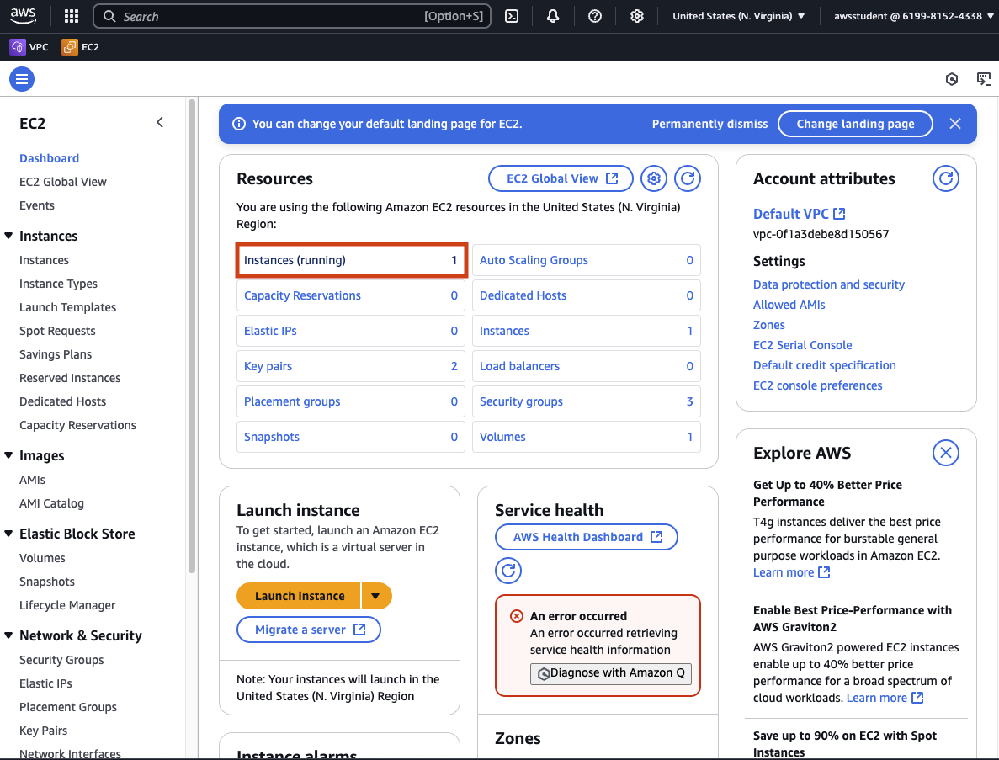
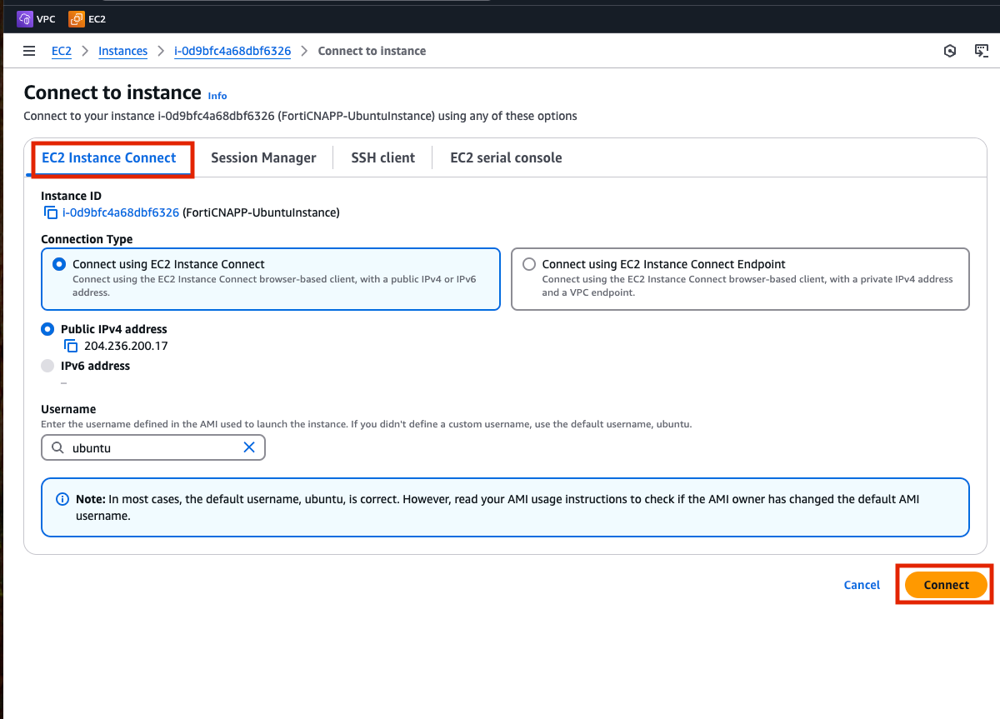
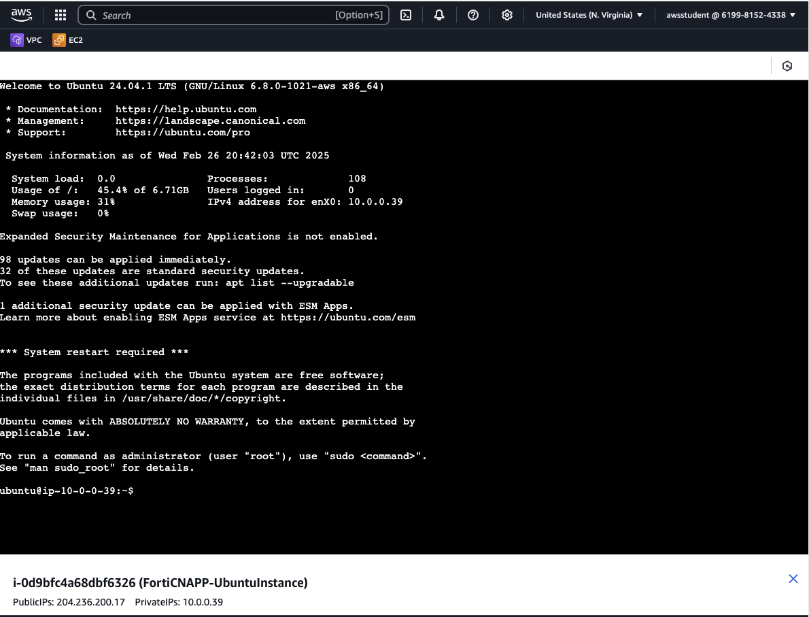
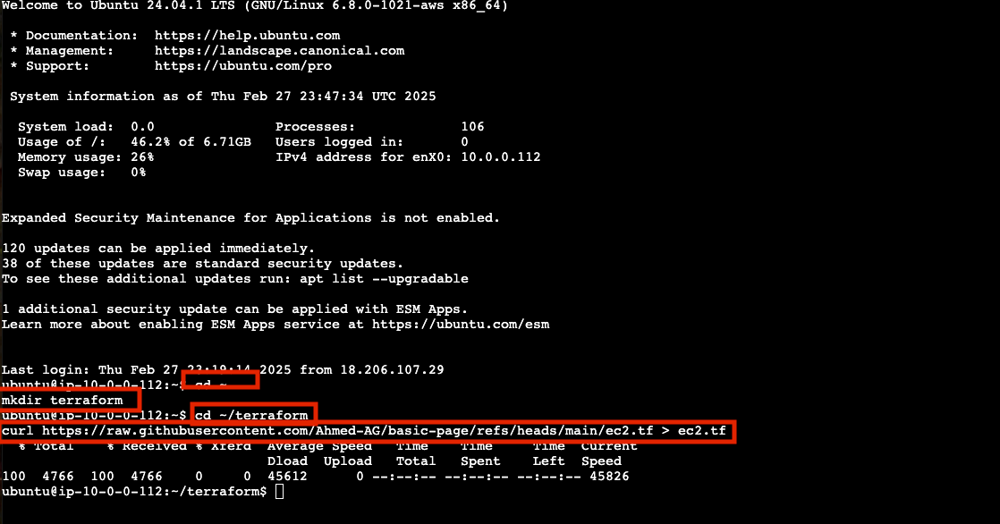
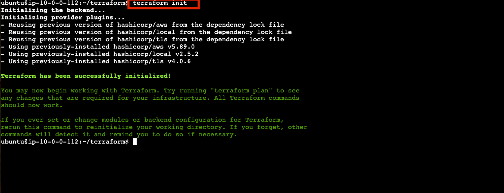
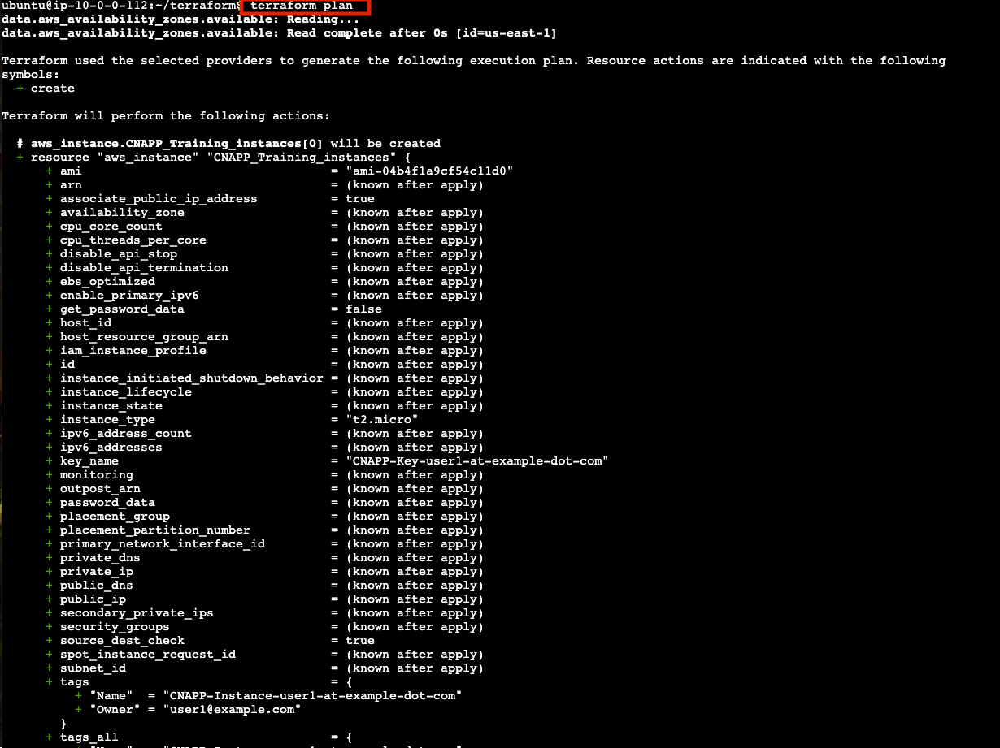
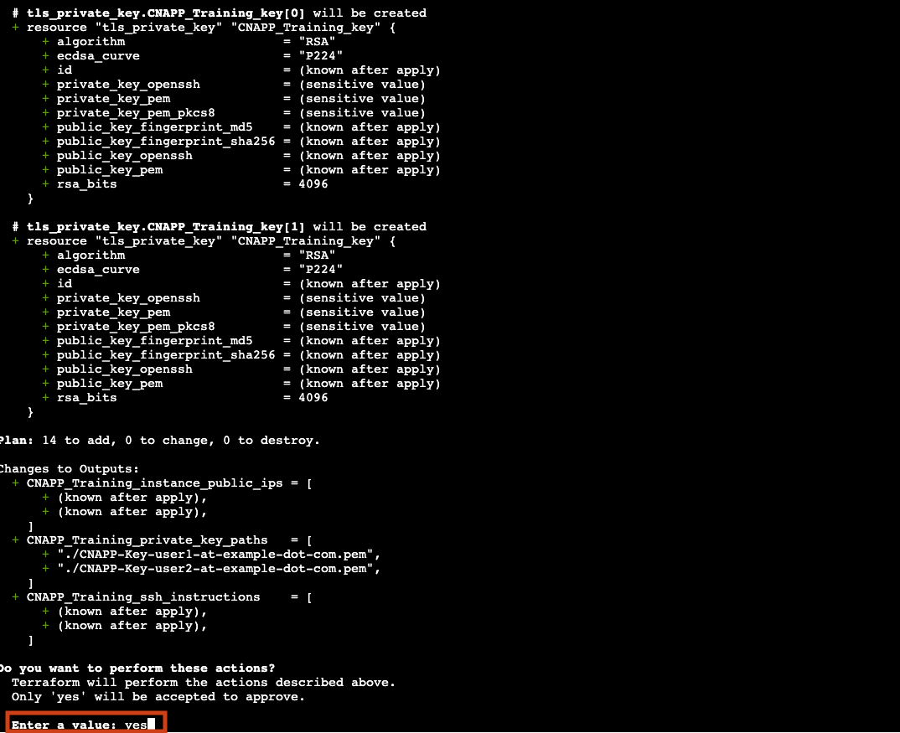
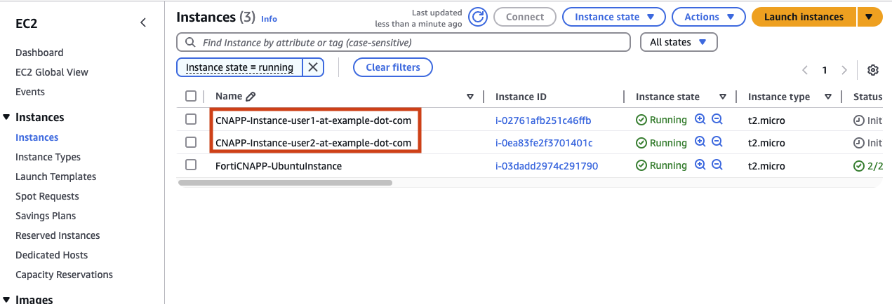
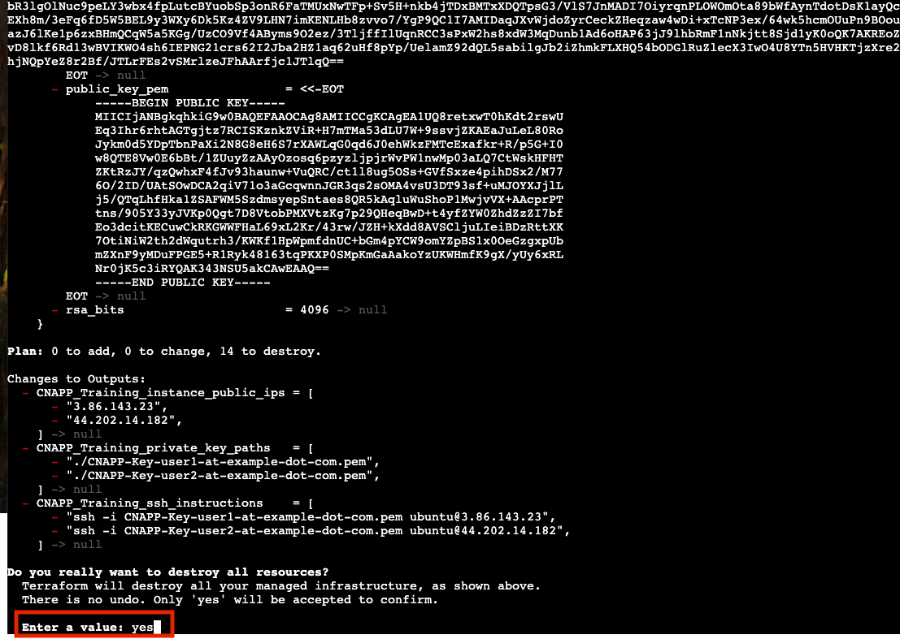

In this lab you will learn the basics of DevOps using Terraform to provision cloud resources.  To keep it simple you will access a virtual server running in AWS with the tools and configuration already setup.  You will download a Infrastructure as Code (IaC) file that contains IaC code.  You will then execute a few commands and two new virtual server, a virtual private network and networking will be setup.  Finally you will confirm these resource exist in the AWS EC2 console.

## Why use IaC tooling like Terraform

In the previous lab you used the AWS Web Console to deploy a single virtual server.  This is often referred to as ClickOps.  ClickOps is a great way to create a small set of resource for learning or testing.  Click Ops is not a ideal way to create full production environments that may have many many services.  Imagine you need to create a hundred virtual server spread out over availability zone and regions.  This is where tools like IaC and Terraform come in.

Using Terraform you can define the cloud resources we want as code.  Running Terraform will then create all those resources.  This could be virtual server, networks, security groups, storage assets, users and much more. If later you need make change to those resources, update your IaC code and rerun Terraform to make those changes.  Further if none of those resources are needed anymore you can have Terraform destroy them.

Terraform is part of modern software development movement know as DevOps.  DevOps combines two seperate concerns operations and development.  It allows these two teams, with different concerns, work together to achieve business objective faster.

## Log into AWS Console

The log in details for your lab provided AWS account are on the left hand of the lab.  Each field has a copy link you can use.

Click on the `Open Console` link.


Copy/paste the `Username`, `Password` and click `Sign In`.


## Access a Virtual Server running in EC2

EC2 is a AWS service that allows for easily creating virtual servers in the cloud.  When moving from an on prem data center to the cloud, EC2 is often part of a 'lift and shift' project.  Each virtual server in EC2 is analogous to a physical server running in your own data center.

Click on (or search for) `EC2`.


Click on `Instance (running)` to see a list of the current virtual machine running.



Select the checkbox next to `FortiCNAPP-UbuntuInstance` and then click on `Connect`.


Use the `EC2 Instance Connect` connection type and click `Connect`.



Instance connect will launch and you will be logged into your own virtual server running in AWS.  From here you will be able to run commands on the virtual server.



## Create Cloud Resources with Terraform

Great, with access to the virtual server let's run some commands!

#### Setup a directory for the Terraform Configuration and download the IaC File

Create a new directory for your Terraform project and navigate and download the file:

```bash
cd ~
mkdir terraform
curl https://raw.githubusercontent.com/Ahmed-AG/basic-page/refs/heads/main/ec2.tf > ~/terraform/ec2.tf
```



#### Review the IaC file

Take a moment to examine the IaC file to see what we are asking Terraform to create. The `cat` command will output the file so you can read it.

```bash
cat ec2.tf
```

Here is a review of the resources we will create:
- VPC
- Subnets
- A group of instances

#### Installing Terraform
Run `terraform --version` to verify that you have Terraform installed:

```bash
terraform --version
```

If Terraform is not installed you can install it by running the following the instructions: [https://developer.hashicorp.com/terraform/tutorials/aws-get-started/install-cli#install-cli]

Then test again:
```bash
terraform --version
```

#### Initializing Terraform 

This initializes the Terraform project and downloads necessary providers:

```bash
cd ~/terraform
terraform init
```



#### View the plan Terraform will apply

```bash
terraform plan
```



#### View the plan Terraform will apply

This previews the changes Terraform will make:

```bash
terraform apply
```

Confirm the action when prompted by typing `yes`.



#### Verifying the Deployment

Once applied, you can check the virtual machine in the AWS console and examine the EC2 service. View the instances and the VPCs



#### Destroying the Infrastructure

To clean up resources, run:

```bash
terraform destroy
```
Confirm the action when prompted by typing `yes`.



#### Conclusion
You have successfully run Terraform and deployed a AWS VPC and virtual servers using Infrastructure as Code! Next steps would be to learn more about what other resources you can mange with Terraform, how to make change to existing Terraform managed resources and what you can do with other clouds like Google and Azure.