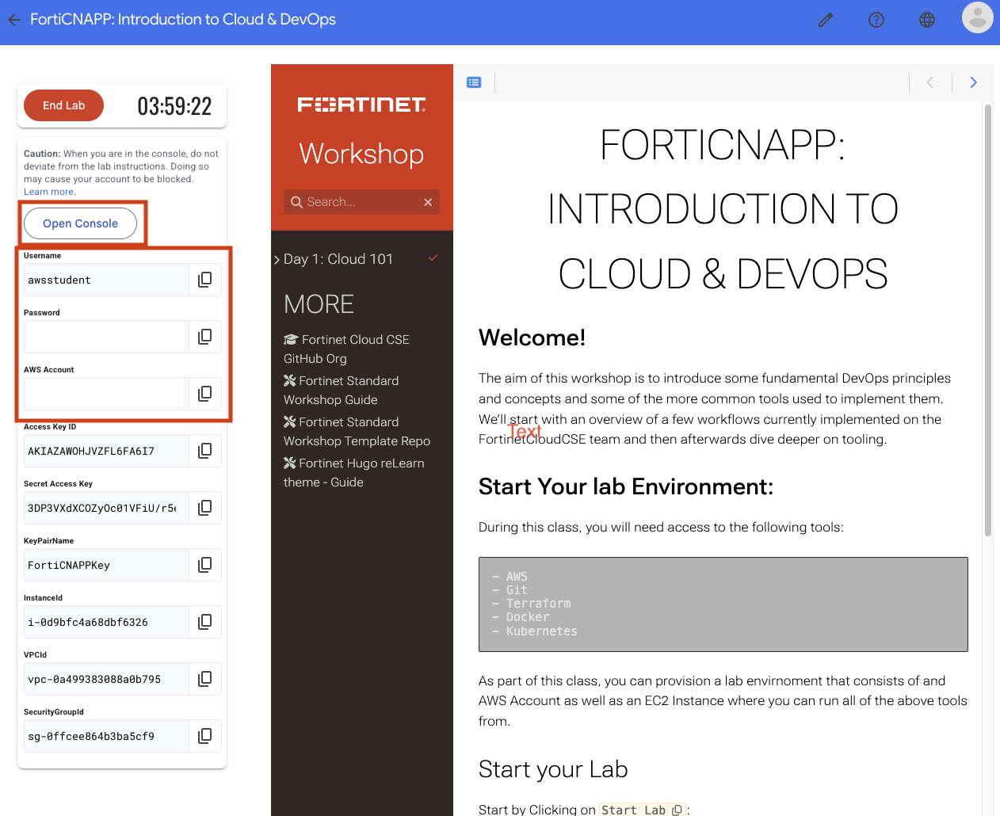
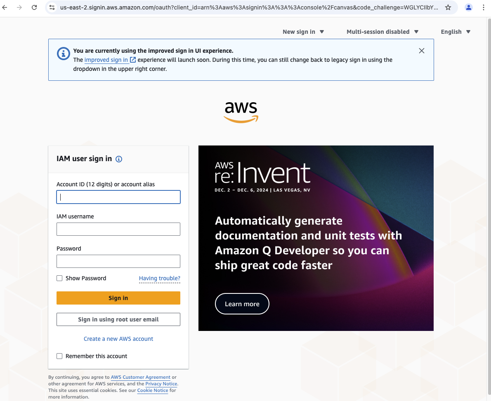

## Lab Overview

The goal of this lab is to learn the basics of the AWS command line interface (CLI). You have already seen how you can use the AWS Web Console to create and manage cloud resouce.  Everything you can do with the Web Console you can do with the CLI.  One advantage of thbuild automation around performing tasks like creating users and fetching lists of virtual server.

## Log into AWS Console

Before we can do anything you will need to get access AWS web console in your browser. The log in details for your lab provided AWS account are on the left hand of the lab.  Each field has a copy link you can use.

Click on the `Open Console` link.



Copy/paste the `Username`, `Password` and click `Sign In`.



## Conenect to FortiCNAPPUbuntu

Connect to the FortiCNAPPUbuntu Instance that was created automatically for you


## Use the AWS CLI

The AWS Command Line Interface (CLI) is a tool that enables users to interact with AWS services using command-line commands. It provides a direct way to manage AWS resources without needing to use the AWS Management Console.

## Installing AWS CLI

Before using AWS CLI, ensure it is installed on your EC2 instance. You can check if AWS CLI is installed with:

```bash
aws --version
```

If it is not installed, install it using the following command (for Amazon Linux 2):

```bash
sudo apt update
sudo apt install unzip -y
curl "https://awscli.amazonaws.com/awscli-exe-linux-x86_64.zip" -o "awscliv2.zip"
unzip -qq awscliv2.zip
sudo ./aws/install
```

Now run :

```bash
aws --version
```
---

## Configuring AWS CLI

Once installed, you need to configure AWS CLI with your credentials. Use the following command:

```bash
aws configure
```

You will be prompted to enter:

1. **AWS Access Key ID**
2. **AWS Secret Access Key**
3. **Default Region Name** (e.g., `us-east-1`, `us-west-2`)
4. **Default Output Format** (`json`, `text`, or `table`)

Use `us-east-1`

This stores the credentials in `~/.aws/credentials` and the configuration in `~/.aws/config`.

---

## Basic AWS CLI Commands

### Check Current AWS Identity

To verify the credentials are working, run:

```bash
aws sts get-caller-identity
```


### Check Current AWS Identity

```bash
aws iam list-attached-role-policies --role-name us-east-1CloudLabRole
```

This should return details about your IAM user or role.

---

### List Available Regions

To see all AWS regions:

```bash
aws ec2 describe-regions --output table
```

---

## EC2 Instance Management

### List All EC2 Instances


```bash
aws ec2 describe-instances
```
 
Press `q` to exit back the terminal


```bash
aws ec2 describe-instances | jq
```


```bash
aws ec2 describe-instances --query 'Reservations[*].Instances[*].[InstanceId,State.Name,PublicIpAddress]' --output json
```

```bash
aws ec2 describe-instances --query 'Reservations[*].Instances[*].[InstanceId,State.Name,PublicIpAddress]' --output table
```

### Dynamically Extract Instance ID

Instead of manually specifying the instance ID, we can extract it dynamically:

```bash
INSTANCE_ID=$(aws ec2 describe-instances --query 'Reservations[*].Instances[*].InstanceId' --output text)
echo "Your Instance ID is: $INSTANCE_ID"
```

---

## S3 Bucket Operations

We will use a predefined S3 bucket: **training-bucket-demo** and a sample file: **sample.txt**

### List All S3 Buckets

```bash
aws s3 ls
```


---

## IAM User and Role Management

### List IAM Users

```bash
aws iam list-users
```

### Create a New IAM User

```bash
aws iam create-user --user-name trainee-user
```

Your role does not allow you to create users

---

## Conclusion

These are just a few essential AWS CLI commands to get started. The AWS CLI is powerful and can manage almost all AWS services directly from the terminal. To explore more, refer to the official AWS CLI documentation:

📌 [AWS CLI Reference Guide](https://docs.aws.amazon.com/cli/latest/reference/)
