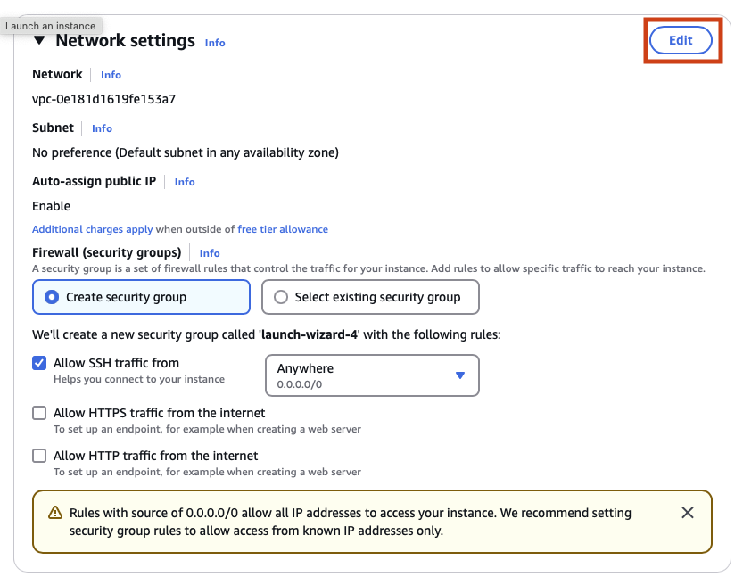
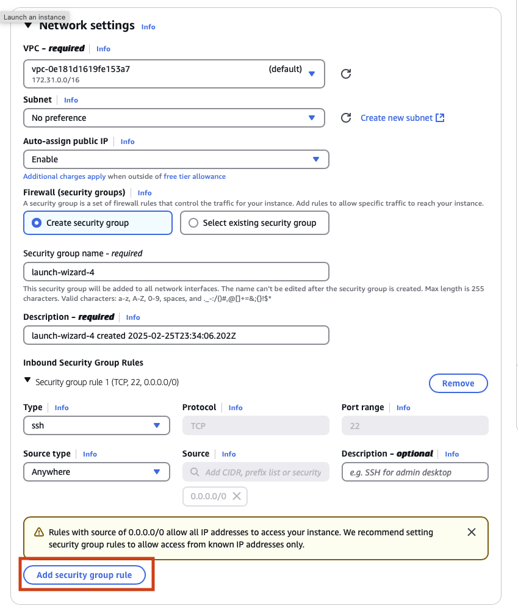

## Lab Overview

In this lab you will learn how easy and fast working in the cloud can be. First you will create a virtual server with a few clicks.  Then you will access that virtual service and run a few commands to get a publicly accessible website up and running.

## Working with AWS Console

In this lab you have all the needed credentials access a brand new AWS account using a web browser.  Visit the link below and click on 'Sign into Console'.

https://aws.amazon.com/console/

Copy/Paste the account ID, IAM username and password into the log in form and click 'Sign In'.

### Create an EC2 Instance

Now that you have access to the AWS Console let's get a virtual server created!  

In AWS virtual servers can be created using their EC2 service offering. Use the search box and type `EC2` and click on the top returned result. 

In EC2 you can create virtual servers in many different regions around the world. By default you will be dropped into `us-east-1` region which is located in the United States, North Virginia.  Find `Instances` in the left hand navigation (Below the Heading of "Instance") and click on it to view your currently running virtual server (hint: you shouldn't have any quite yet).

Now to create a brand new virtual server with public IP address and of type `Ubuntu`:

Click on Lunch Instance


Give you new virtual server a name you will remember, keep it safe for work!
Next choose Ubuntu as the operating system you want running in your new virtual server.


Now we need configure what credentials we will use to access this virtual server once it is up and running.
Select **NAME_OF_KEY_CREATED_BY_QWICKLABS** from the drop down.  This key was created by Qwkilabs and can be used with AWS or from you local machine to access your virtual server.


Next we will need to edit the Network Setting.  In AWS EC2 Security groups control the network access inbound and outbound.  

We will need to open up at least 2 ports: 22 and 3000.  Port 22 will be used for accessing the virtual server to run commands, and port 3000 will be used to access our new website.

Click `Edit` in the Network Setting



Click `Add security group rule`



Edit the new rule by setting `Type` to `Custom TCP`, `Source` to `Anywhere `and `Port range` to `3000`.


Finally click on `Launch Instance` to create you brand new virtual server!


### EC2 Instance Access

You can see that there are two instances. The one you created and the other one that was created automatically for you.

There are several ways for us to access the instance. We will use the AWS Console to do that.

Right click on the instance name (FortiCNAPP-UbuntuInstance) and choose `Connect`


On the Connect to instance window, keep the default option of `EC2 Instance Connect` and click on `Connect`


If succesfull, you should see a terminal like interface within your AWS Console. This is where you will be executing different commands throughout this class.


### Setup node runtime 

Before we can run the software project for you new website we will need to get Node setup.  Node is a more modern version of the browse language Javascript.  Many modern website and services use Node.

Update your system and install **Node**:

```bash
sudo apt update && sudo apt install -y node npm
```

### Deploy a Simple Web Page

The code for your new website is stored in git repository hosted on Github. Git/Github allow developers to collaborate together and share code.  Almost no modern company develops all of their own code. Developers rely on using many other projects to save time and effort while delivering business value.

Clone the website repository:

```bash
git clone https://github.com/lacework-community/hello-world.git
```

Install the website dependecies:

```bash
cd hello-world
npm install
```

Start the website:

```bash
node index.js
```

### Access your brand new website

Go back to the EC2 Service, click on your instance. You will find the public IP address of that instance. Try to access it on `http://<Your-IP>:3000` using your browser

### Take moment and recap

With little to no knowledge of the cloud you 
* create a new virtual machine
* configured the network access
* installed the Node runtime
* cloned website code
* started the website
* allowed the world access to your new website

All of this happened without involving IT, development, security, management, operations. 

What could go wrong?

## Use the AWS CLI

The AWS Command Line Interface (CLI) is a tool that enables users to interact with AWS services using command-line commands. It provides a direct way to manage AWS resources without needing to use the AWS Management Console.

## Installing AWS CLI

Before using AWS CLI, ensure it is installed on your EC2 instance. You can check if AWS CLI is installed with:

```bash
aws --version
```

If it is not installed, install it using the following command (for Amazon Linux 2):

```bash
sudo apt update
sudo apt install unzip
curl "https://awscli.amazonaws.com/awscli-exe-linux-x86_64.zip" -o "awscliv2.zip"
unzip awscliv2.zip
sudo ./aws/install
```

Now run :

```bash
aws --version
```
---

## Configuring AWS CLI

Once installed, you need to configure AWS CLI with your credentials. Use the following command:

```bash
aws configure
```

You will be prompted to enter:

1. **AWS Access Key ID**
2. **AWS Secret Access Key**
3. **Default Region Name** (e.g., `us-east-1`, `us-west-2`)
4. **Default Output Format** (`json`, `text`, or `table`)

Use `us-east-1`

This stores the credentials in `~/.aws/credentials` and the configuration in `~/.aws/config`.

---

## Basic AWS CLI Commands

### Check Current AWS Identity

To verify the credentials are working, run:

```bash
aws sts get-caller-identity
```

This should return details about your IAM user or role.

---

### List Available Regions

To see all AWS regions:

```bash
aws ec2 describe-regions --output table
```

---

## EC2 Instance Management

### List All EC2 Instances


```bash
aws ec2 describe-instances
```
 
Press `q` to exit back the terminal


```bash
aws ec2 describe-instances | jq
```


```bash
aws ec2 describe-instances --query 'Reservations[*].Instances[*].[InstanceId,State.Name,PublicIpAddress]' --output json
```

```bash
aws ec2 describe-instances --query 'Reservations[*].Instances[*].[InstanceId,State.Name,PublicIpAddress]' --output table
```

### Dynamically Extract Instance ID

Instead of manually specifying the instance ID, we can extract it dynamically:

```bash
INSTANCE_ID=$(aws ec2 describe-instances --query 'Reservations[*].Instances[*].InstanceId' --output text)
echo "Your Instance ID is: $INSTANCE_ID"
```

---

## S3 Bucket Operations

We will use a predefined S3 bucket: **training-bucket-demo** and a sample file: **sample.txt**

### List All S3 Buckets

```bash
aws s3 ls
```


---

## IAM User and Role Management

### List IAM Users

```bash
aws iam list-users
```

### Create a New IAM User

```bash
aws iam create-user --user-name trainee-user
```

Your role does not allow you to create users

---

## Conclusion

These are just a few essential AWS CLI commands to get started. The AWS CLI is powerful and can manage almost all AWS services directly from the terminal. To explore more, refer to the official AWS CLI documentation:

📌 [AWS CLI Reference Guide](https://docs.aws.amazon.com/cli/latest/reference/)
