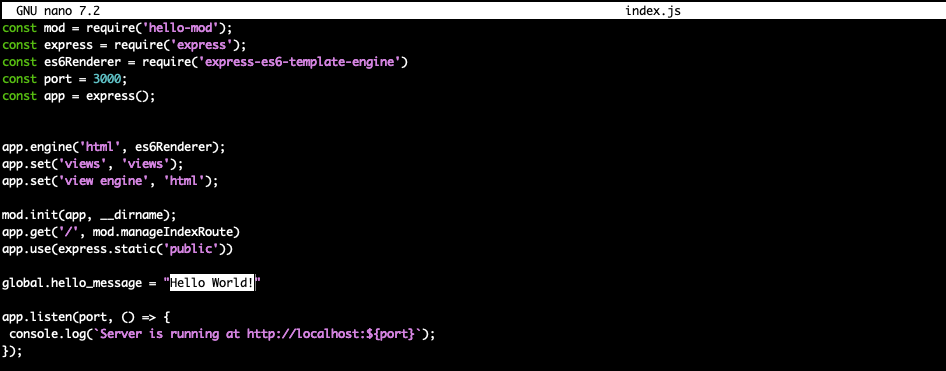
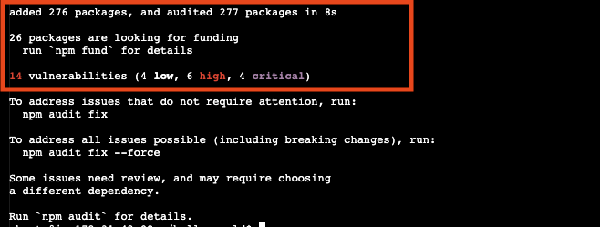
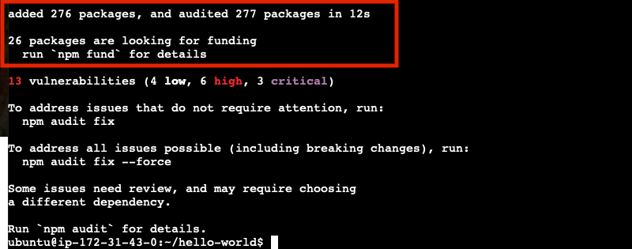
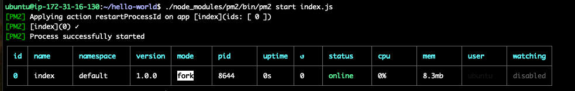

## Lab Overview

The goal of this lab is to, as quickly as possible, get a simple web site running and exposed to the internet.  This website will require some compute resources to run on, expsore to the Internet (inboud/outboud) and permissions to access a centrally managed database.

Application Diagram


To achieve your goal you will use the public cloud to create resources, download code, grant permissions and finally expose your website to the entire world.  All this will be achieved using the Amazon Web Services (AWS) web console,a web browser and a few simple commands.

Good luck!

## Log into AWS Console

Before we can do anything you will need to get access AWS web console in your browser. The log in details for your lab provided AWS account are on the left hand of the lab.  Each field has a copy link you can use.

Click on the `Open Console` link.


Copy/paste the `Username`, `Password` and click `Sign In`.


### Create an Virtual Server

Now that you have access to the AWS Console let's get working!

To get your website working you will need a server where you can run the code.  In a traditional on premise data center you would request a server from your operations team.  In the public cloud you can create your own resources, include servers, without having to ask anyone.

In AWS servers can be created using their `EC2` service. Use the search box and type `EC2` and click on the top returned result. 


In EC2 you can create virtual servers in many different regions around the world. By default, you will be dropped into `us-east-1` region which is located in the United States, North Virginia.  Find `Instances` in the left hand navigation (Below the Heading of "Instance") and click on it to view your currently running virtual server.

Click on `Launch Instance`


Give you new virtual server a name you will remember, keep it safe for work!
Next choose Ubuntu as the operating system you want running in your new virtual server.


Now we need configure what credentials we will use to access this virtual server once it is up and running.
Select `FortiCNAPPKey` from the drop-down.  This key was created by Qwkilabs and can be used within AWS or from you local machine to access your virtual server.


Finally click on `Launch Instance` to create you brand new virtual server.


Phew! You now have a brand new virtual server up and running in EC2.  Click on the ID for you new virtual server to view more details.


### Access your Virtual Server

Next you need to gain access to your new virtual server so you can make it actually do something useful.  Developers often connect to servers using a secure shell (SSH).  AWS offers a simple way to do this called `Instance Connect`.  Instance Connect will allow you to gain a connection to your new virtual server using your browser.  After gaining access you will be able to run commands on the server.

Right-click on the instance name of your new instance and choose `Connect`.


On the Connect to instance window, keep the default option of `EC2 Instance Connect` and click on `Connect`


If succesful, you should see a terminal like interface within your AWS Console. Now you are ready to run some commands.


### Download the website code

The code for your new website is stored in git repository hosted on GitHub. Git/GitHub allow developers to collaborate together and share code.  Almost no modern company develops all of their own code. Developers rely on using many other projects to save time and effort while delivering business value.

The command below will download the code to your virtual server

```bash
git clone https://github.com/lacework-community/hello-world.git
```

You can confirm that code is on your server by listing all the file us the `ls` command.

```bash
ls hello-world
```

### Make the site your own

Before you start up you new website let's make a simple change. The default message is `Hello World`.  The is kind of boring.  Let's update that message to something a bit more fun.

You will be using a program called `nano` to make this change. Below is the command to start `nano` opening the HTML page that is the landing page for your web application.

```bash
nano hello-world/public/index.html
```



Nano tries to be as user friendly as it can be.  You can use your arrow keys to move around, use delete to remove the `Hello World` text.  You can type your new message as normal. Once you are done making change use the control key and `o` key, followed by enter to confirm the change.  Finally control 'x' to exit `nano`.

### Install node runtime

Before we can even start up your website you will need to get the Node runtime setup.  Node is a more modern version of the browse language JavaScript.  Many modern websites and services use Node.

The command below will use the Ubuntu built in package management application (apt) to download NodeJs (the Node runtime) and npm (Node's own package manager).

```bash
sudo apt update && sudo apt install -y nodejs npm
```

Notice how many files are installed running just these few commands. Hopefully there aren't any negative side effecs of making all these changes.

### Install your website dependencies 

As we mentioned all modern software is built on top of other software.  Your simple website is no exception.  In Node these dependencies are list in a file call `package.json`.  

To see your dependencies run this command. The `cat` command will output the content of a file.

```bash
cat hello-world/package.json
```



Before you can start your website you will need to install these dependencies.  Luckily you already installed Node package manager `npm`. Run the command below to chagne directory and install the needed Node packages.

```bash
cd ~/hello-world
npm install
```



Notice that we only had 3 direct dependencies in our `package.json` file, but we actually added 72 packages. This is because our direct dependencies have their own dependencies, which in turn might yet more dependencies.  Software is built ontop of software. Turtles all the way down.

Even more concerning is the warning that there are 8 vulnerabilities found, including 4 of high severity.

Well no time to worry about all of that, you have a website to get up and running!

### Install your website dependencies 

To start you website simple run this command:

```bash
node index.js
```



### Access your brand-new website

Go back to the AWS EC2 Service, click on your instance. You will find the public IP address of that instance and copy it.


Note: use the copy link and not the 'open address' link

You will need to add the port the website is running on `3000`.

`http://<Your-IP>:3000`

### Hello is anyone listening?

You might have noticed that when you visited the URL of your newly launched website nothing happened, your browser tab just spun and spun. AWS EC2 be default only allows inbound network connections on port 22, the default port of SSH.  Since your website is not running on port 22 all other inbound traffic was blocked. Next task is to open up some ports to allow inbound traffic to reach your virtual server.

AWS EC2 manages network access via `Security Groups`. Return to AWS EC2, find you EC2 instance, switch to the `security group` tab and click on your security group name.


Ensure you are on the Incound Rules tab and click on `Edit inbound rules`.


You will need click `Add rule` to create a new inbound rule. Then specify the `Protocol` as `TCP`, `Port range` of `1000-6000` and ensure anyone on the internet can access by specifying a `Source` of `0.0.0.0/0`. 

Notice that we opened up way more ports than we need and AWS warns us about allowing all inbound IP addresses. These are just the type of decisions that are now entrusted to anyone with a cloud account.

Anyway... click `Save rules`, let's get this web site up!


Refresh the URl of your website to see if we can get traffic flowing.

### Wait that doesn't look right

Your new website isn't showing your fancy message. Rather it is complaining about an IAM role not being attached.  


As you might recall from the very beginning we mentioned that the website would need access to a centrally managed database. Access to cloud resources, like databases, is allowed through Identity and Access Management (IAM) IAM has conecpts like roles, policies and permissions that control what can and can't be accesssed by users and cloud resources.

By default when you create a new EC2 instance there is no IAM role attached.  This means that your virtual machine can not access any other cloud resources at the moment.


### Attach a new IAM role

To attach a new IAM role to your virtual server click on `Action`, then `Security` and finally `Modify IAM role`.


Before you can attach a role you will have to create a new on.  Click on `Create new IAM role` to open a new window in the IAM service page.


On the IAM Role page you will find a list of all the current roles.  You want a new role that can be attached to your virtual machine so click on `Create role`.


There are a few type of roles you can create select `AWS service` and then in the `Service or use case` drop down select `EC2`.  This will allow your to attach this new role to an EC2 virtual server.


Now comes the time to choose which permissions to grant.  Notice that there are over a thousand possible permissions policies you could grant.  Rather than go over all of these trying to find the right one, we will take the simple path and grant `AdministratorAccess`. Choosing the admin role grants more permissions than you need, but ensures that the database access will work. Once again these are just the types of decisions that anyone with a cloud account face everyday.


Finally the hardest choice you have made all day. What do you name this new role? Pick something easy to remember and click `Create role`.


Return to the previous page where you where trying to attache a role.  Click the circle icon, select your new role from the drop down and click `Update IAM role`.


Finally check your website again. Fingers crossed it all worked.

## Share the love

Please drop a link to your shiny new website into the Teams chat for today.
We all want to see what custom message you created!

## Take moment and recap

Here are the high level step you took
* create a new virtual machine
* cloned website code from github
* updated the website code
* installed the Node runtime
* installed node packages via npm
* started the website
* configured the network access
* create a new role and attached it to your virtual machine
* access your wonderful new website

All of this happened without involving IT, development, security, management, operations. 

What could go wrong?

## Use the AWS CLI

The AWS Command Line Interface (CLI) is a tool that enables users to interact with AWS services using command-line commands. It provides a direct way to manage AWS resources without needing to use the AWS Management Console.

## Installing AWS CLI

Before using AWS CLI, ensure it is installed on your EC2 instance. You can check if AWS CLI is installed with:

```bash
aws --version
```

If it is not installed, install it using the following command (for Amazon Linux 2):

```bash
sudo apt update
sudo apt install unzip -y
curl "https://awscli.amazonaws.com/awscli-exe-linux-x86_64.zip" -o "awscliv2.zip"
unzip -qq awscliv2.zip
sudo ./aws/install
```

Now run :

```bash
aws --version
```
---

## Configuring AWS CLI

Once installed, you need to configure AWS CLI with your credentials. Use the following command:

```bash
aws configure
```

You will be prompted to enter:

1. **AWS Access Key ID**
2. **AWS Secret Access Key**
3. **Default Region Name** (e.g., `us-east-1`, `us-west-2`)
4. **Default Output Format** (`json`, `text`, or `table`)

Use `us-east-1`

This stores the credentials in `~/.aws/credentials` and the configuration in `~/.aws/config`.

---

## Basic AWS CLI Commands

### Check Current AWS Identity

To verify the credentials are working, run:

```bash
aws sts get-caller-identity
```


### Check Current AWS Identity

```bash
aws iam list-attached-role-policies --role-name us-east-1CloudLabRole
```

This should return details about your IAM user or role.

---

### List Available Regions

To see all AWS regions:

```bash
aws ec2 describe-regions --output table
```

---

## EC2 Instance Management

### List All EC2 Instances


```bash
aws ec2 describe-instances
```
 
Press `q` to exit back the terminal


```bash
aws ec2 describe-instances | jq
```


```bash
aws ec2 describe-instances --query 'Reservations[*].Instances[*].[InstanceId,State.Name,PublicIpAddress]' --output json
```

```bash
aws ec2 describe-instances --query 'Reservations[*].Instances[*].[InstanceId,State.Name,PublicIpAddress]' --output table
```

### Dynamically Extract Instance ID

Instead of manually specifying the instance ID, we can extract it dynamically:

```bash
INSTANCE_ID=$(aws ec2 describe-instances --query 'Reservations[*].Instances[*].InstanceId' --output text)
echo "Your Instance ID is: $INSTANCE_ID"
```

---

## S3 Bucket Operations

We will use a predefined S3 bucket: **training-bucket-demo** and a sample file: **sample.txt**

### List All S3 Buckets

```bash
aws s3 ls
```


---

## IAM User and Role Management

### List IAM Users

```bash
aws iam list-users
```

### Create a New IAM User

```bash
aws iam create-user --user-name trainee-user
```

Your role does not allow you to create users

---

## Conclusion

These are just a few essential AWS CLI commands to get started. The AWS CLI is powerful and can manage almost all AWS services directly from the terminal. To explore more, refer to the official AWS CLI documentation:

📌 [AWS CLI Reference Guide](https://docs.aws.amazon.com/cli/latest/reference/)
