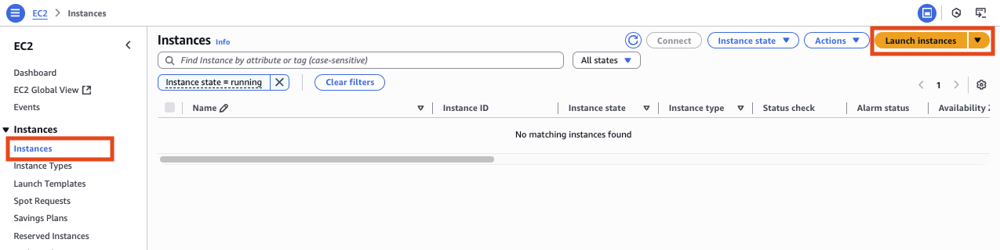
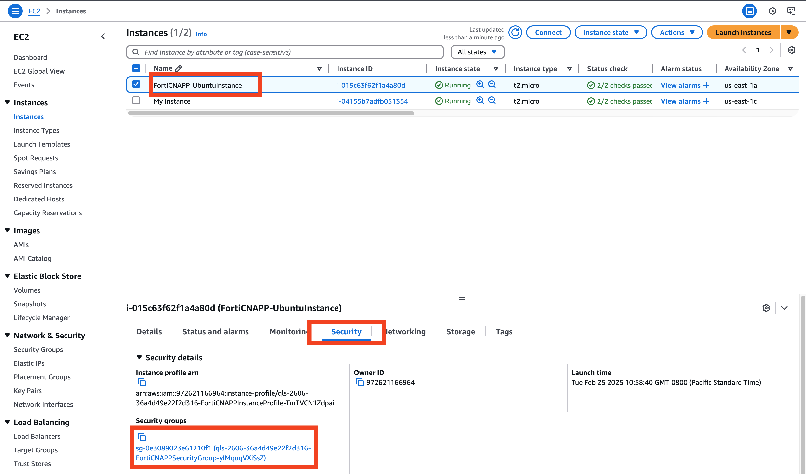
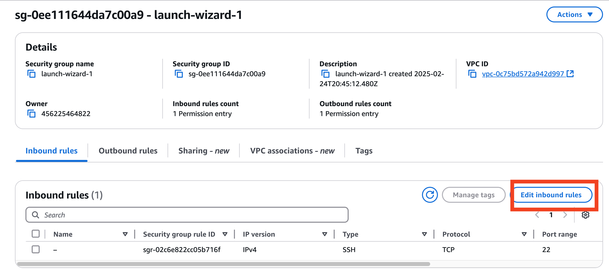

## Working with AWS Console
### Create an EC2 Instance

Go to `EC2` Service, and create an instance with public IP address and of type `Ubuntu`:

Click on Lunch Instance



Give it a a name and chose Ubuntu


Choose a key or create your own:


Configure network access control (Security Group)


### EC2 Instance Access

There are several ways for us to access the instance. We will use the AWS Console to do that.

Right click on the instance name and choose `Connect`


On the Connect to instance window, keep the default option of `EC2 Instance Connect` and click on `Connect`


If succesfull, you should see a terminal like interface within your AWS Console. This is where you will be executing different commands throughout this class.


### Install Apache Web Server

Update your system and install **Apache**:

```bash
sudo apt update && sudo apt install -y apache2
```

Enable and start Apache:

```bash
sudo systemctl enable apache2
sudo systemctl start apache2
```

---

### Deploy a Simple Web Page

Create a simple **index.html** file:

```bash
cd ~
curl https://github.com/Ahmed-AG/basic-web-page/blob/main/index.html
cp index.html /var/www/html/index.html
```

Ensure proper file permissions:

```bash
sudo chmod -R 755 /var/www/html
```

---
### Allow access to port 80 (Security Group)

Right click on your instance and select `Security` then click on the `security groups` name



Click on `Edit inbound rules`



Click on `Add rule`


Choose `HTTP`, `My Ip` as the source and click `Save`


### Access the web server

Go back to the EC2 Service, click on your instance. You will find the publick IP address of that instance. Try to access it on `http://<Your-IP>` using your browser

## Use the AWS CLI

The AWS Command Line Interface (CLI) is a tool that enables users to interact with AWS services using command-line commands. It provides a direct way to manage AWS resources without needing to use the AWS Management Console.

## Installing AWS CLI

Before using AWS CLI, ensure it is installed on your EC2 instance. You can check if AWS CLI is installed with:

```bash
aws --version
```

If it is not installed, install it using the following command (for Amazon Linux 2):

```bash
sudo apt update
sudo apt install unzip
curl "https://awscli.amazonaws.com/awscli-exe-linux-x86_64.zip" -o "awscliv2.zip"
unzip awscliv2.zip
sudo ./aws/install
```

Now run :

```bash
aws --version
```
---

## Configuring AWS CLI

Once installed, you need to configure AWS CLI with your credentials. Use the following command:

```bash
aws configure
```

You will be prompted to enter:

1. **AWS Access Key ID**
2. **AWS Secret Access Key**
3. **Default Region Name** (e.g., `us-east-1`, `us-west-2`)
4. **Default Output Format** (`json`, `text`, or `table`)

Use `us-east-1`

This stores the credentials in `~/.aws/credentials` and the configuration in `~/.aws/config`.

---

## Basic AWS CLI Commands

### Check Current AWS Identity

To verify the credentials are working, run:

```bash
aws sts get-caller-identity
```

This should return details about your IAM user or role.

---

### List Available Regions

To see all AWS regions:

```bash
aws ec2 describe-regions --output table
```

---

## EC2 Instance Management

### List All EC2 Instances


```bash
aws ec2 describe-instances
```


```bash
aws ec2 describe-instances | jq
```


```bash
aws ec2 describe-instances --query 'Reservations[*].Instances[*].[InstanceId,State.Name,PublicIpAddress]' --output json
```

```bash
aws ec2 describe-instances --query 'Reservations[*].Instances[*].[InstanceId,State.Name,PublicIpAddress]' --output table
```

### Dynamically Extract Instance ID

Instead of manually specifying the instance ID, we can extract it dynamically:

```bash
INSTANCE_ID=$(aws ec2 describe-instances --query 'Reservations[*].Instances[*].InstanceId' --output text)
echo "Your Instance ID is: $INSTANCE_ID"
```

---

## S3 Bucket Operations

We will use a predefined S3 bucket: **training-bucket-demo** and a sample file: **sample.txt**

### List All S3 Buckets

```bash
aws s3 ls
```


---

## IAM User and Role Management

### List IAM Users

```bash
aws iam list-users
```

### Create a New IAM User

```bash
aws iam create-user --user-name trainee-user
```

### Attach a Policy to a User

```bash
aws iam attach-user-policy --user-name trainee-user --policy-arn arn:aws:iam::aws:policy/AmazonS3ReadOnlyAccess
```

---

## CloudWatch Logs

### List CloudWatch Log Groups

```bash
aws logs describe-log-groups
```

### Retrieve the Latest Logs from a Specific Log Group

```bash
aws logs get-log-events --log-group-name /aws/lambda/demo-function --log-stream-name demo-log-stream
```

---

## Conclusion

These are just a few essential AWS CLI commands to get started. The AWS CLI is powerful and can manage almost all AWS services directly from the terminal. To explore more, refer to the official AWS CLI documentation:

📌 [AWS CLI Reference Guide](https://docs.aws.amazon.com/cli/latest/reference/)
