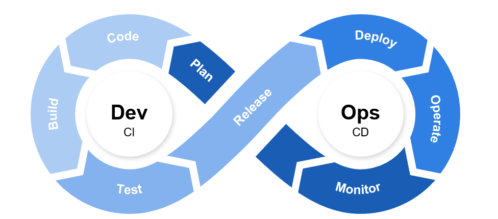
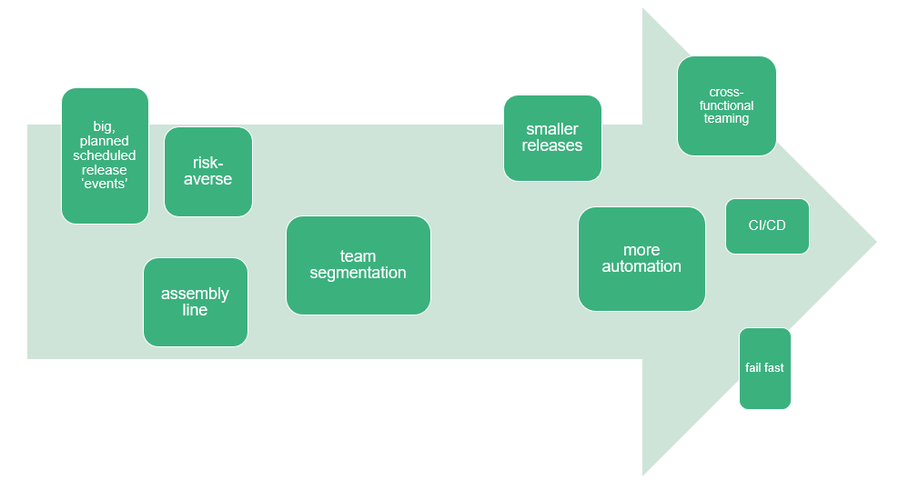
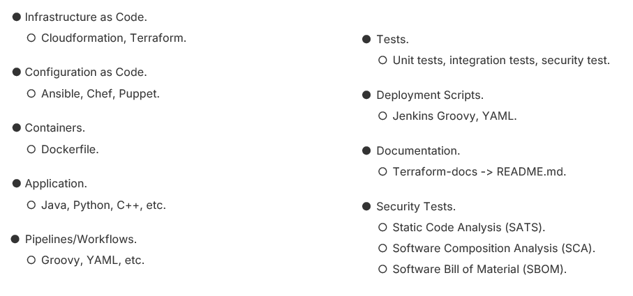
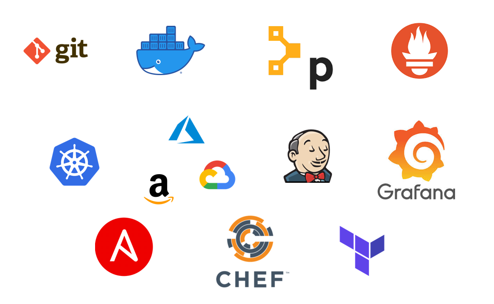
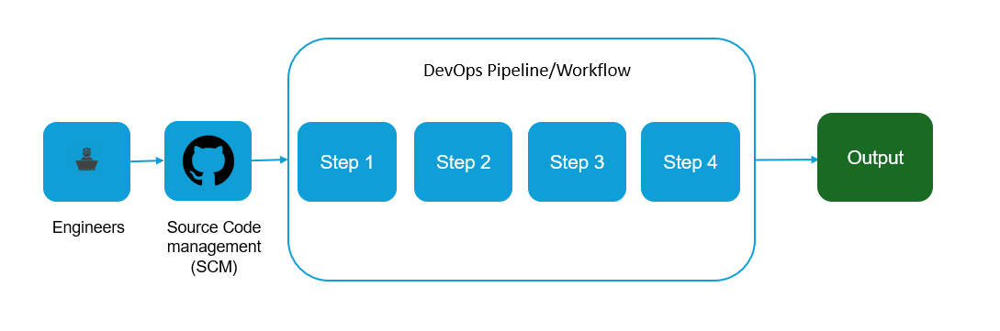
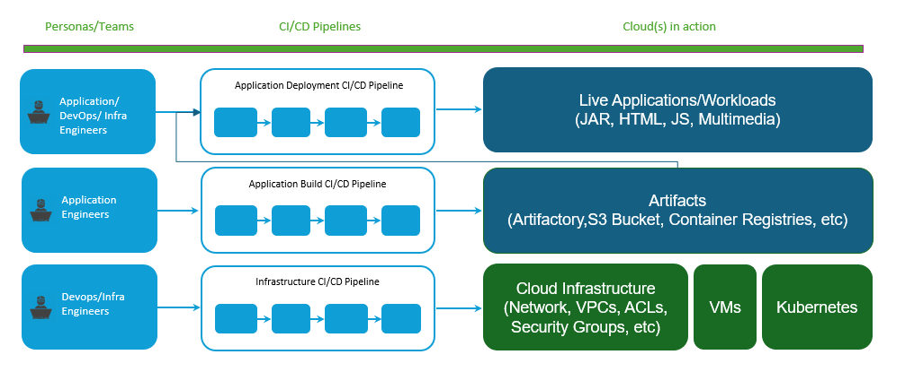

  
 
##### *DevOps [is a methodology that] integrates and automates the work of software development and IT operations as a means for improving and shortening the systems development lifecycle.*
**--Wikipedia**

##### *Central to DevOps is the idea of continuous delivery and shipping code as fast, small, frequent deployments. These smaller deployments make it easier to test and release code. By adopting DevOps, companies aim to maintaine or increase their rate of deployment over time.*
**--Humanitec**

  
DevOps is a **culture** and a **mindset** centered around automating processes and enabling **faster** and **more collaborative** deployments.
  

The software development lifecycle describes a formalized process for **organized** and **efficient** software development.

  
DevOps is a philosophy and methodology that **optimizes** and **enhances** the SDLC.

  
Past to present:

Shift to *Everything as Code* and *GitOps*:

Common Devops Tools:
  

  
How it works:

A modern deployment workflow:

#### Famous Use Cases

In 2008, Netflix experienced an outage causing major delays in their DVD-shipment processes. They moved their deployments to the cloud and adopted DevOps processes and increased their subscriber base eight-fold and it's monthly streaming hours a thousand-fold. 

