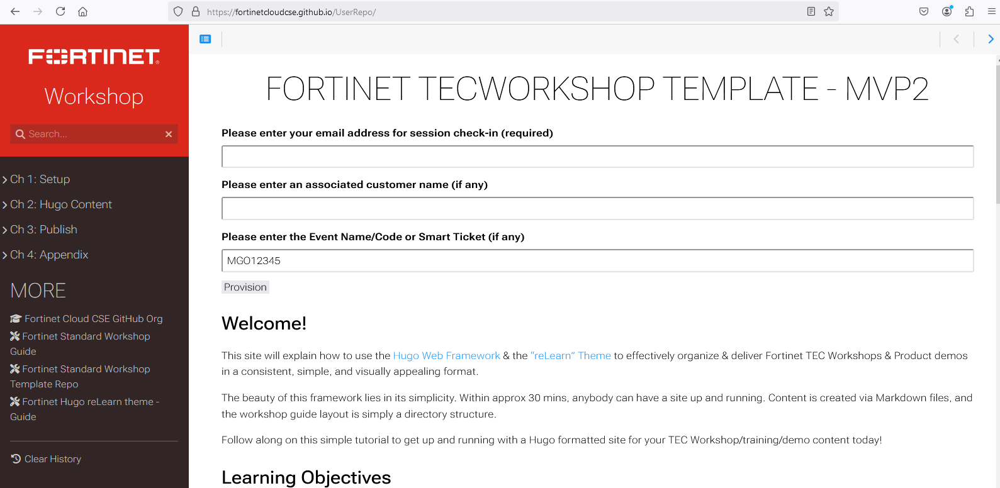

<br></br>
In this section, you'll walk through our Workshop repo creation process to see how our workshops are created and to get a feel for a sample CI/CD workflow.

<br></br>
### The Fortinet Cloud CSE Team Workshop Devlopment Process
 


#### Initial Steps: User Request and Script Launch

Initially, users send a request to FortinetCloudCSE GitHub org admins to create a repo.

Once that request is received, admins run a script which creates:

**A GitHub Repo containing all the code needed to deploy the workshop
**A Jenkins pipeline to run SAST scans with FortiDevSec
**API calls which are sent to FortiDevSec to create an application for SAST scanning

#### Step Two

Workshop developers clone the new repo and begin writing workshop code. 

Docker is used to facilitate local worshop development.

First, a Docker image containing necessary libraries and components for workshop deployment is created.

```bash
docker build -t fortinet-hugo . --target=prod
```

Here is the Dockerfile which builds this image:

```bash
# syntax=docker/dockerfile:1.5-labs

#alpine has shell, busybox does not
FROM hugomods/hugo:std as base

FROM base as dev
ADD https://github.com/FortinetCloudCSE/CentralRepo.git#prreviewJune23 /home/CentralRepo

WORKDIR /home/CentralRepo

RUN apk add --update --no-cache python3 py3-pip && ln -sf python3 /usr/bin/python

ENTRYPOINT ["/home/CentralRepo/scripts/local_copy.sh"]

FROM base as prod
ADD https://github.com/FortinetCloudCSE/CentralRepo.git#main /home/CentralRepo

WORKDIR /home/CentralRepo

RUN apk add --update --no-cache python3 py3-pip && ln -sf python3 /usr/bin/python

ENTRYPOINT ["/home/CentralRepo/scripts/local_copy.sh"]
```

#### Step Three

Then, a container based on that image is run and certain local files which contain relevant code are mounted into the container.

```bash
./scripts/docker_run.sh server
```

Inside the container, a Hugo server is launched and the workshop code in its current state, now mounted into the container, is deployed and accessible in a web browser.

The script which runs the container is shown here:

```bash
#!/bin/bash
# when updating this script, update in BOTH UserRepo(for newly cloned repos) AND CentralRepo(for use in updating existing repos from the Container)

myarray=( "build" "server" "shell" "generate_toml" "update_scripts" "update_fdevsec" )

[[ "$#" > "1" ]] || [[ ! " ${myarray[*]} " =~ " $1 " ]] && echo "Usage: ./scripts/docker_run.sh [ build | server | generate_toml | update_scripts | update_fdevsec | shell ]" && exit 1

case "$1" in
  "server" | "shell" | "build" )
    cmd="docker run --rm -it
      -v $(pwd):/home/UserRepo
      --mount type=bind,source=$(pwd)/hugo.toml,target=/home/CentralRepo/hugo.toml
      -p 1313:1313 fortinet-hugo:latest $1"
    ;;

  "generate_toml" | "update_scripts" | "update_fdevsec")
    cmd="docker run --rm -it
    -v $(pwd):/home/UserRepo
    fortinet-hugo:latest $1"
    ;;

  *)
    cmd=""
    ;;
esac

echo "**** Here's the docker run command we're using:   $cmd ****"
$cmd
```

Effectively, running the script with command './scripts/docker_run.sh server' runs the following **docker run** command:

```bash
docker run --rm -it
    -v $(pwd):/home/UserRepo
    --mount type=bind,source=$(pwd)/hugo.toml,target=/home/CentralRepo/hugo.toml
    -p 1313:1313 fortinet-hugo:latest server"
```

The **server** parameter tells the process to run a Hugo server inside the container to be viewable in the browser. The code as currently existing on the developer's machine is mounted into the container and reflected in the deployed application.

During this step, developers can see the current state of the application based on the code they've written. When they are satisfied with the state of the app, they can do a **git commit** and **git push** which will push the code and run a GitHub Workflow action to deploy the code to GitHub Pages.

#### Step Four

The key parts of this GitHub Actions workflow are shown below.

First, on the GitHub Actions runner, which is a virtual machine either hosted by GitHub or alternately deployed and maintained by the developer and his or her team, the docker image is built and the container is run:

```bash
...
...
      - name: Build image
        run: DOCKER_BUILDKIT=1 docker build -t fortinet-hugo . --target=prod
      - name: Build static app
        run: |
         CONT_ID=$(docker run -d -v ${{github.workspace}}:/home/UserRepo \
            -v ${{github.workspace}}/hugo.toml:/home/CentralRepo/hugo.toml fortinet-hugo:latest build)
         sleep 5
         rm -rf ${{github.workspace}}/docs
         docker cp $CONT_ID:/home/CentralRepo/public ${{github.workspace}}/docs
         docker stop $CONT_ID
         docker rm $CONT_ID
...
...
```

Here, as opposed to running a server, we are telling the process to go ahead and build the application using the code we've mounted into the container. Docker needs to launch an actual container to do this, and the container ID is stored in a environment variable, which is referenced in the following steps to copy the produced artifacts to the local machine to a location where GitHub pages will look for it to deploy it. Then, the container is stopped and deleted. Its work is done.




