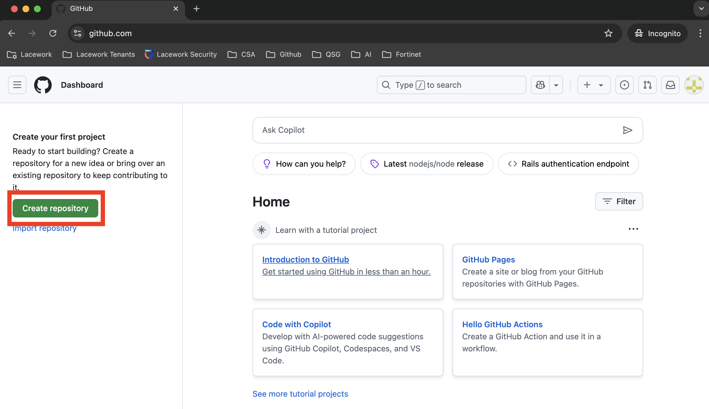
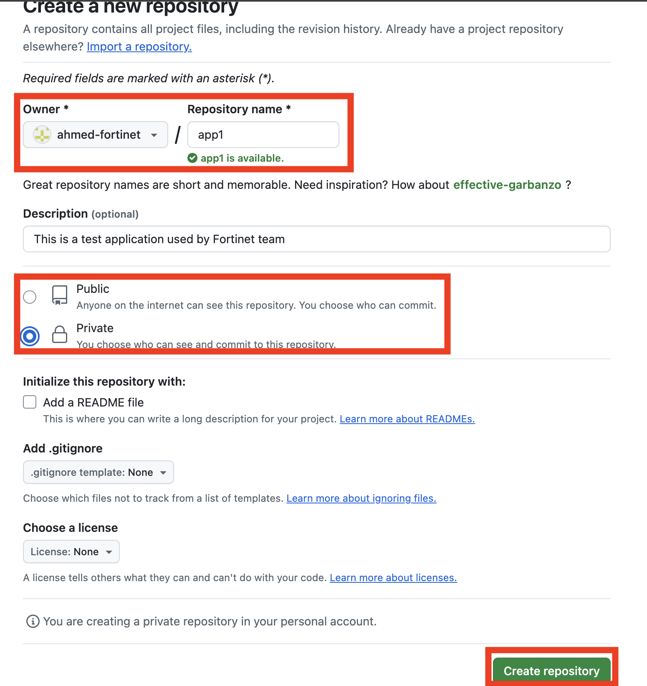
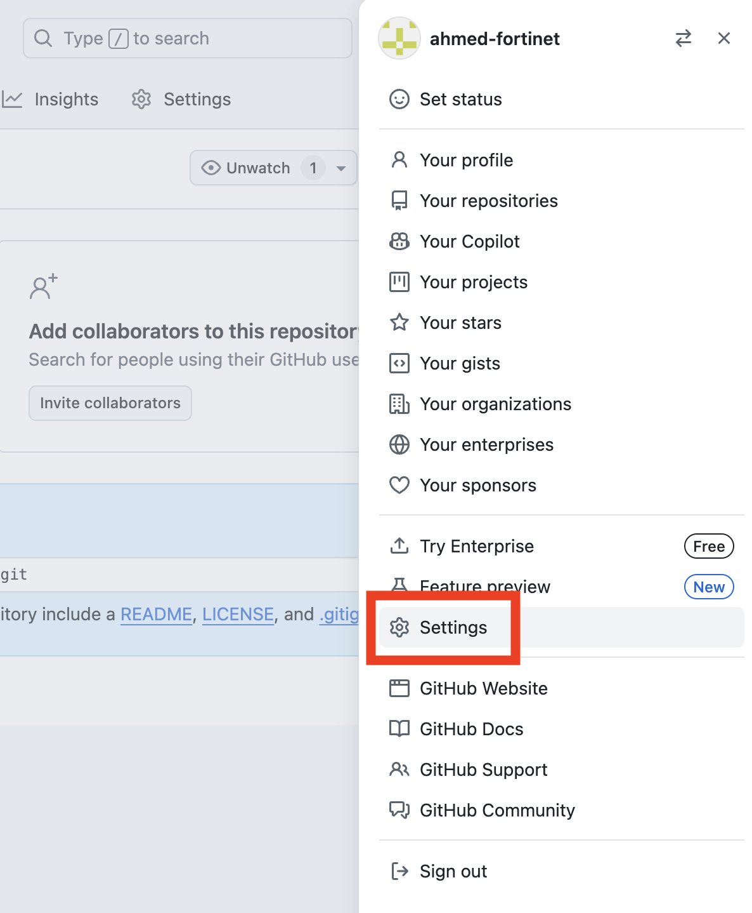
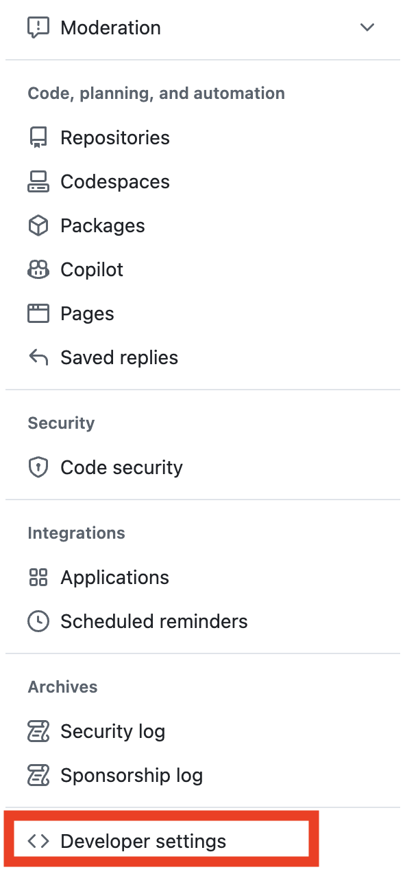
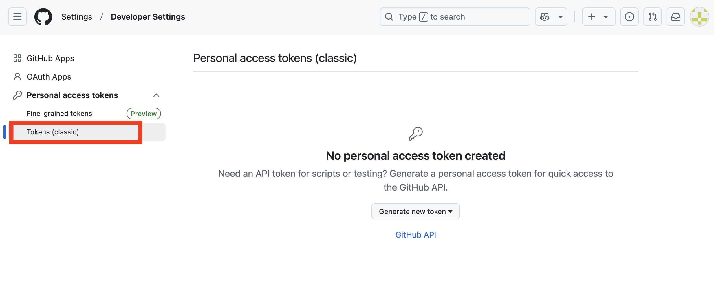
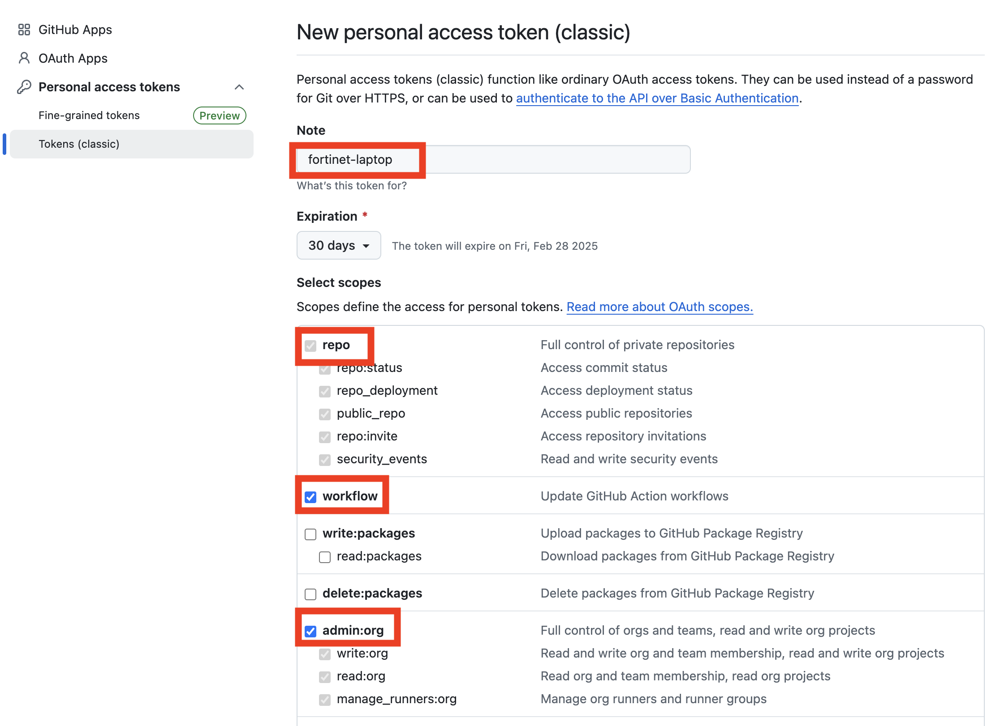
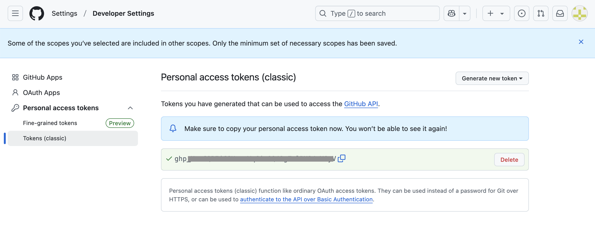
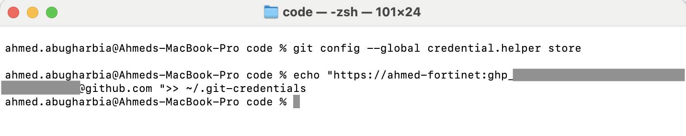

## Git Basics

## Sign up

Start by going to https://github.com and create a new github account if you do not already have one


## Create the First Reposotiroy

Once your account is verified, start by creating a new repository from scratch. Click on `create repository`:




You will need to give the new repository a name, have the name to be `app1`. Note that this will create a repository with a unique URL that will look similar to `https://github.com/<YOUR USRNAME>/app1`.

You will also need to decide if you want to make this repository `Public` or `Private`. Let us have as Private. Finally click on `Create Repository`




The next stepo is to manage authentication. Github supports multple authentication methods, for simplicity, we will use a Personal Token (PAT). To create a PAT, click on your profile picture on the top right corner then cick on `Settings`



Scroll all the way down and click on `Developers Settings`:




Click on `Tokens (Classic)`



Give the token a name and allow it access to the `repo`, `workflow`, and `admin:org`:



This will generate a token for you.



Leave that winow ooen an open a terminal. You will have to configure your system to authenticat to Github using the toekn you just created.

In the terminal, execute the following command:

```bash
git config --global credential.helper store
```

<!--  -->

### Cloning a Repository

Cloning a repository essentially downloads it and sets up a local copy.

To clone a repository, run:

```bash
git clone git clone https://<YOUR-USER_NAME>@github.com/ahmed-fortinet/app1.git
```

Expected output:

```console
code % git clone https://ahmed-fortinet@github.com/ahmed-fortinet/app1.git
Cloning into 'app1'...
Password for 'https://ahmed-fortinet@github.com': 
warning: You appear to have cloned an empty repository.
```

This means the repository has been successfully downloaded and is ready for use.

### Checking the Status of Your Repository

It’s always a good idea to check the status of your repository to see what changes have been made. The git status command helps you understand whether there are untracked files, changes to existing files, or staged files waiting to be committed.

Run:

```bash
cd app1
git status
```

Here’s an example of what you might see:

```console
On branch main

No commits yet

nothing to commit (create/copy files and use "git add" to track)
```

This output tells you that there’s an untracked file (newREASME) in your repository.

### Add changes

Try to add a file `README` to the repo:
```bash
cd app1
echo "#Weclome to Git 101" > README
```

### Adding a Single File to the Staging Area

When you’re ready to track a new file or include a modified file in the next commit, you need to add it to the staging area. To do this, use the git add command, specifying the file name.

For example:

```bash
git status
```

Note that the file is now being tracked.

```bash
git add REASME
```

This command won’t produce any output, but if you run git status afterward, you’ll see that the file is staged:

```console
Changes to be committed:
  (use "git restore --staged <file>..." to unstage)
        new file:   REASME
```

### Adding All Changes to the Staging Area
If you’ve made multiple changes and want to stage them all at once, use the git add . command. This stages all changes, including new, modified, and deleted files.

Start by adding multple files:

```bash
touch file1 file2 file3
```

```bash
git add .
git status
```

Again, this command doesn’t display any output, but a follow-up git status will confirm that all changes have been staged. Here’s an example:

```console
Changes to be committed:
  (use "git restore --staged <file>..." to unstage)
        new file:   file1.txt
        modified:   file2.txt
        deleted:    file3.txt
```

Now, everything is ready to be committed to your repository.


You can copy this into an `.md` file directly! Let me know if you need any adjustments.


## Commit Changes

To save your changes to the repository, you need to create a commit. A commit is like a snapshot of your project at a specific point in time.

First, use the following command to commit staged changes with a message describing the changes:

```bash
git commit -m "Commit message"
```

This command creates a new commit using the changes in the staging area and assigns it a message. For example, if you run:

```bash
git commit -m "Initial commit"
```

You might see output like this:

```console
[main (root-commit) 4b825dc] Initial commit
 1 file changed, 1 insertion(+)
 create mode 100644 REASME
```

If you have changes that haven’t been staged, you can commit them directly by using the -a flag. This flag stages all tracked files (but not new, untracked files) and commits them in one step:

```bash
git commit -a -m "Commit message"
```

For example:

```bash
git commit -a -m "Update configuration files"
```

The output will be similar to:

```console
[main 1a2b3c4] Update configuration files
 3 files changed, 10 insertions(+), 2 deletions(-)
```

This command is a quick way to commit changes to files that are already tracked without needing to use git add first.


Branching
Branches allow you to work on separate lines of development within a repository.

To list all branches in the repository, run:

```bash
git branch
```

To create a new branch, use:

```bash
git branch <branch-name>
```

Replace <branch-name> with the desired name of the branch. For example:

```bash
git branch feature/new-feature
```

To switch to an existing branch, run:

```bash
git checkout <branch-name>
```

To create a new branch and switch to it in a single command, use:

```bash
git checkout -b <new-branch-name>
```

For example:

```bash
git checkout -b feature/new-feature
```

To merge another branch into the current branch, use:

```bash
git merge <branch-name>
```

This integrates the changes from the specified branch into your current branch.

Finally, to delete a branch that you no longer need, run:

```bash
git branch -d <branch-name>
```

For example:

```bash
git branch -d feature/new-feature
```

Remote Repositories
To link your local repository to a remote repository, use the following command:

```bash
git remote add origin pository-u<rerl>
```

Replace <repository-url> with the URL of the remote repository. For example:

```bash
git remote add origin https://github.com/user/repository.git
```

To verify that the remote was added correctly, run:

```bash
git remote -v
```

You’ll see something like:

```console
origin  https://github.com/user/repository.git (fetch)
origin  https://github.com/user/repository.git (push)
```

To push changes from your local branch to the remote repository, use:

```bash
git push origin <branch-name>
```

For example:

```bash
git push origin main
```

To fetch the latest changes from the remote branch without merging, run:

```bash
git fetch
```

To fetch and merge changes from the remote branch into your current branch, use:

```bash
git pull origin <branch-name>
```

For example:

```bash
git pull origin main
```

Miscellaneous
To view the differences between your working directory and the staging area, run:

```bash
git diff
```

To view the differences for a specific file, use:

```bash
git diff <file>
```

For example:

```bash
git diff REASME
```

To see who made changes to specific lines in a file, use:

```bash
git blame <file>
```

For example:

```bash
git blame REASME
```

This displays the commit hash, author, and timestamp for each line of the file.

Finally, to display detailed information about a specific commit, run:

```bash
git show <commit-hash>
```

For example:

```bash
git show 1a2b3c4
```

This command outputs details about the commit, including the author, date, and the changes made.

