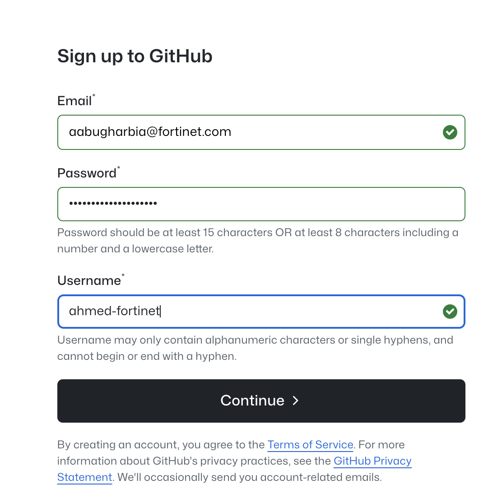

# Version Control

## Git Basics

## Sign up




## Create the First Reposotiroy


### Cloning a Repository

If you want to work on an existing repository, you can clone it from a remote location (like GitHub or GitLab). Cloning essentially downloads the repository and sets up a local copy.

To clone a repository, run:

```bash
git clone <repository-url>
```
For example, if you clone a repository hosted on GitHub, Git will output something like:

```console
Cloning into '<repository-name>'...
remote: Enumerating objects: 42, done.
remote: Counting objects: 100% (42/42), done.
remote: Compressing objects: 100% (35/35), done.
Receiving objects: 100% (42/42), done.
```

This means the repository has been successfully downloaded and is ready for use.

### Checking the Status of Your Repository

It’s always a good idea to check the status of your repository to see what changes have been made. The git status command helps you understand whether there are untracked files, changes to existing files, or staged files waiting to be committed.

Run:

```bash
git status
```

Here’s an example of what you might see:

```console
On branch main
Your branch is up to date with 'origin/main'.

Untracked files:
  (use "git add <file>..." to include in what will be committed)
        newfile.txt

nothing added to commit but untracked files present (use "git add" to track)
```

This output tells you that there’s an untracked file (newfile.txt) in your repository.

### Adding a Single File to the Staging Area

When you’re ready to track a new file or include a modified file in the next commit, you need to add it to the staging area. To do this, use the git add command, specifying the file name.

For example:

```bash
git add file.txt
```

This command won’t produce any output, but if you run git status afterward, you’ll see that the file is staged:

```console
Changes to be committed:
  (use "git restore --staged <file>..." to unstage)
        new file:   file.txt
```

### Adding All Changes to the Staging Area
If you’ve made multiple changes and want to stage them all at once, use the git add . command. This stages all changes, including new, modified, and deleted files.

```bash
git add .
```

Again, this command doesn’t display any output, but a follow-up git status will confirm that all changes have been staged. Here’s an example:

```console
Changes to be committed:
  (use "git restore --staged <file>..." to unstage)
        new file:   file1.txt
        modified:   file2.txt
        deleted:    file3.txt
```

Now, everything is ready to be committed to your repository.


You can copy this into an `.md` file directly! Let me know if you need any adjustments.


## Commit Changes

To save your changes to the repository, you need to create a commit. A commit is like a snapshot of your project at a specific point in time.

First, use the following command to commit staged changes with a message describing the changes:

```bash
git commit -m "Commit message"
```

This command creates a new commit using the changes in the staging area and assigns it a message. For example, if you run:

```bash
git commit -m "Initial commit"
```

You might see output like this:

```console
[main (root-commit) 4b825dc] Initial commit
 1 file changed, 1 insertion(+)
 create mode 100644 file.txt
```

If you have changes that haven’t been staged, you can commit them directly by using the -a flag. This flag stages all tracked files (but not new, untracked files) and commits them in one step:

```bash
git commit -a -m "Commit message"
```

For example:

```bash
git commit -a -m "Update configuration files"
```

The output will be similar to:

```console
[main 1a2b3c4] Update configuration files
 3 files changed, 10 insertions(+), 2 deletions(-)
```

This command is a quick way to commit changes to files that are already tracked without needing to use git add first.


Branching
Branches allow you to work on separate lines of development within a repository.

To list all branches in the repository, run:

```bash
git branch
```

To create a new branch, use:

```bash
git branch <branch-name>
```

Replace <branch-name> with the desired name of the branch. For example:

```bash
git branch feature/new-feature
```

To switch to an existing branch, run:

```bash
git checkout <branch-name>
```

To create a new branch and switch to it in a single command, use:

```bash
git checkout -b <new-branch-name>
```

For example:

```bash
git checkout -b feature/new-feature
```

To merge another branch into the current branch, use:

```bash
git merge <branch-name>
```

This integrates the changes from the specified branch into your current branch.

Finally, to delete a branch that you no longer need, run:

```bash
git branch -d <branch-name>
```

For example:

```bash
git branch -d feature/new-feature
```

Remote Repositories
To link your local repository to a remote repository, use the following command:

```bash
git remote add origin <repository-url>
```

Replace <repository-url> with the URL of the remote repository. For example:

```bash
git remote add origin https://github.com/user/repository.git
```

To verify that the remote was added correctly, run:

```bash
git remote -v
```

You’ll see something like:

```console
origin  https://github.com/user/repository.git (fetch)
origin  https://github.com/user/repository.git (push)
```

To push changes from your local branch to the remote repository, use:

```bash
git push origin <branch-name>
```

For example:

```bash
git push origin main
```

To fetch the latest changes from the remote branch without merging, run:

```bash
git fetch
```

To fetch and merge changes from the remote branch into your current branch, use:

```bash
git pull origin <branch-name>
```

For example:

```bash
git pull origin main
```

Miscellaneous
To view the differences between your working directory and the staging area, run:

```bash
git diff
```

To view the differences for a specific file, use:

```bash
git diff <file>
```

For example:

```bash
git diff file.txt
```

To see who made changes to specific lines in a file, use:

```bash
git blame <file>
```

For example:

```bash
git blame file.txt
```

This displays the commit hash, author, and timestamp for each line of the file.

Finally, to display detailed information about a specific commit, run:

```bash
git show <commit-hash>
```

For example:

```bash
git show 1a2b3c4
```

This command outputs details about the commit, including the author, date, and the changes made.

