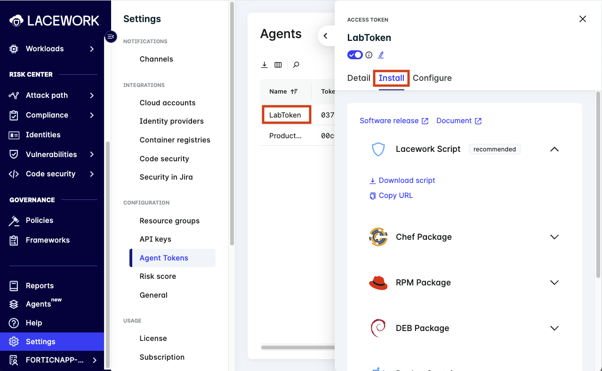
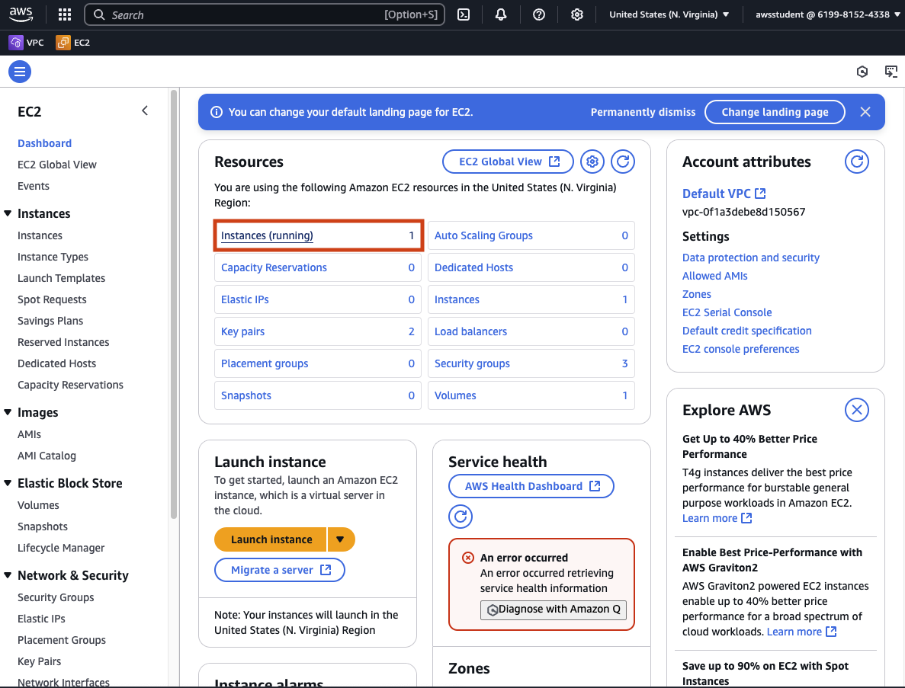
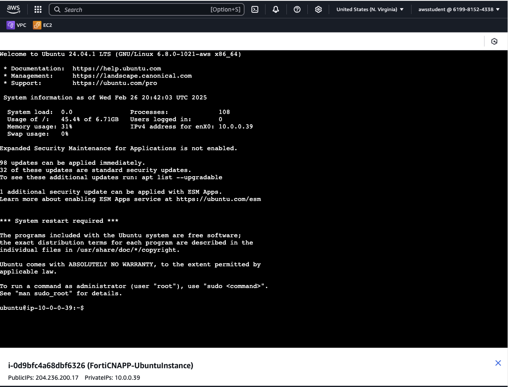

## Lab Overview

In this lab you will perform manual steps to get the FortiCNAPP linux agent setup on a virtual server running in AWS EC2. To complete these steps you will have to log into FortiCNAPP and get the agent install script download link.  You will then log into your lab provided AWS account where a virtual server has been pre-provisioned.  Using EC2 instance connect you will gain access to the virtual server and run a series of commands to get the FortiCNAPP installed.

## Why use the FortiCNAPP Linux Agent?

The FortiCNAPP agent provides a variety of benefits from a security perspective. FortiCNAPP features fall under two broad buckets of `Risks` and `Threats` . `Risks` are any existing miss-configurations or vulnerabilities that exist on your virtual server. `Threats` are an active behavior that is using your `Risks` to gain access to your cloud or compute resources.

On the `Risks` side the FortiCNAPP agent scans well defined directories looking for vulnerable code libraries and operating system packages.  The agent also scans for binaries artifacts that might be used by attackers, like metasploit.

On the `Threats` side the FortiCNAPP agent watches for anomalous runtime behavior like new applications being started, changes to files and inbound/outbound network activity.

Together these signals can help determine if a virtual server has been breached, what the attacker did and possible weaknesses that enabled the breach.

## Access FortiCNAPP

First step will be to gain access to the `FORTICNAPP-LAB` tenant in the `partner-demo` org tenant.

### Log into FortiCNAPP using Magic Link

Open the link below in a browser

https://partner-demo.lacework.net

Enter your Fortinet email address and click `Get sign in link`.  


Check your email for an email from Lacework (now know as FortiCNAPP).  The email will contain a link that will allow you to log into the FortiCNAPP tenant.


Click on `Sign in` to gain access to the partner-demo tenant.


Ensure that you are using the `FORTICNAPP-LAB` tenant.  You have been added to this tenant as an admin.  Using the wrong tenant can cause issues due to lack of permissions.


## Review and Select Agent Installation Method

Excellent! Now that you have gained access to the `FORTICNAPP-LAB` tenant let's see what options we have to setup a FortiCNAPP agent.

### Find the Agent token and install options

Using the left hand navigation browser to `Setting` -> `Agent Tokens`.


#### Review agent installation options

Click on the `Lab Token` to bring up the fly out panel on the right side of the page.  Each token has a unique identifier the agent uses when sending up metrics, as well as fetching runtime configuration from the FortiCNAPP back end.  

The default `Detail` page shows the token and other basic details.  You can also review the configuration options, but please do no make any changes!

Click on `Install` to see all the options there are to install an agent. There are links to release details and documentation for the FortiCNAPP agent that can provide more information.  




#### Copy the install script for later use 

Click on the `Copy URL` link.  The link to download a script, with the agent token baked in, will be in your copy buffer.  Paste the link into a text file locally for use in a future step.

Feel free to also use the `Download script` link to get the full script on your own computer if you want to review the script.


## Log into AWS Console

The log in details for your lab provided AWS account are on the left hand of the lab.  Each field has a copy link you can use.

Click on the `Open Console` link.


Copy/paste the `Username`, `Password` and click `Sign In`.


## Access a Virtual Server running in EC2

EC2 is a AWS service that allows for easily creating virtual servers in the cloud.  When moving from an on prem data center to the cloud, EC2 is often part of a 'lift and shift' project.  Each virtual server in EC2 is analogous to a physical server running in your own data center.

Click on (or search for) `EC2`.


Click on `Instance (running)` to see a list of the current virtual machine running.



Select the checkbox next to `FortiCNAPP-UbuntuInstance` and then click on `Connect`.


Use the `EC2 Instance Connect` connection type and click `Connect`.


Instance connect will launch and you will be logged into your own virtual server running in AWS.  From here you will be able to run commands on the virtual server.



## Install FortiCNAPP Agent

Now that you have access to execute commands on a virtual server running in AWS EC2 let's get the FortiCNAPP agent installed and configured.

### Recall install script you copy for later use

Find the URL you copied from the Agent Token panel in FortiCNAPP.  Now is the time for us to use it!

### Run commands on your virtual server

The first command we are going to run is `wget`.  This command will take a single parameter of the URL for the install script. Once run `wget` will download the script from GitHub and save it on the virtual server as a file named `install.sh`.

```bash
wget REPLACE_WITH_YOUR_AGENT_INSTALL_URL
```
Next you will need to run `chmod` to make the `install.sh` executable.  This will allow us to run the script on the virtual server.

```bash
chmod +x install.sh
```

Finally you will run the `install.sh` script as the root user using the `sudo` command.  The `sudo` command allows the script to make changes to the virtual server as user with elevated privileges. 

```bash
sudo ./install.sh
```


Running `install.sh` will download the FortiCNAPP agent to your virtual server and setup a config file that will include the agent token.  Once the script completes the agent should be up and running.  Metrics will be collected and sent to the FortiCNAPP backend.

## Confirm Agent is running

You can run these commands to see that the agent is up and running.

See the status of the agent

```bash
sudo /var/lib/lacework/datacollector -status
```

Review the log from the agent. The logs can be used to trouble shoot issues.

```bash
tail /var/log/lacework/datacollector.log
```

## Review and next steps

Congratulations! You have enabled runtime visibility for a virtual server running in AWS EC2.  With the agent running you will get insights into the behavior of this server.

After FortiCNAPP creates a baseline of normal behavior alerts will be generated for anomalous behavior like new application running, file change and network activity.

Once the agent has collected data for 15 minutes you should be able to find you agent in the `Agents` page in FortiCNAPP.


Next steps would be to learn how to setup the agent as part of a CI/CD pipeline or baking the agent into a private AWS server image file.  These type of steps will ensure that the FortiCNAPP agent is installed as part of the normal deployment mechanisms and remove the manual process we just went through.
