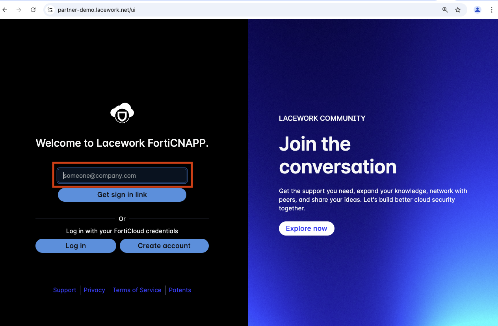
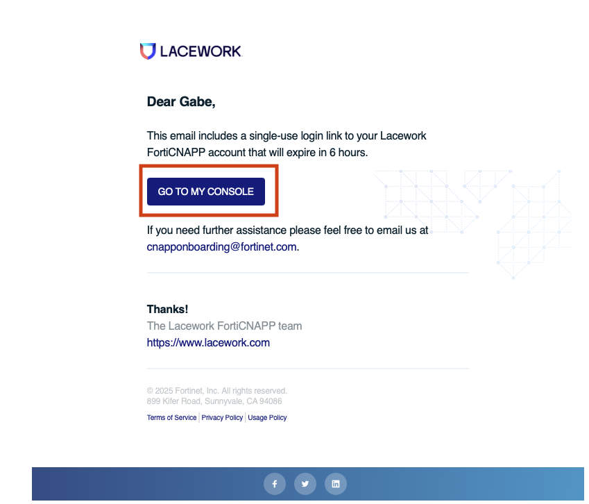

## Lab Overview

In this lab you will perform manual steps to get the FortiCNAPP cloud integration setup in AWS. To complete these steps you will log into the AWS Console in a web browser.  You will then log into FortiCNAPP and find the various option for integrating with cloud providers.  You will choose to use AWS Cloud Formation as the installation option.  Cloud Formation is a Infrastructure as Code (IaC) declarative language developed by AWS to manage cloud resources. You will then follow a link from FortiCNAPP that will take you into the Cloud Formation service in AWS where you will run the Cloud Formation code to setup the integration.  Once complete your cloud account will have forged a trust relationship with FortiCNAPP's AWS account that allows gathering activity logs and configuration details.  FortiCNAPP will process this data in it's back end to baseline what is normal for your cloud deployment.  Then FortiCNAPP will be able to alert you to deviation from normal behavior in your cloud environment.

## Why Integrate a cloud account with FortiCNAPP?

The FortiCNAPP cloud integration provides a variety of benefits from a security perspective. FortiCNAPP features fall under two broad buckets of `Risks` and `Threats`. `Risks` are any existing miss-configurations or vulnerabilities that exist in your cloud account. `Threats` are an active behavior that is using your `Risks` to gain access to your cloud or compute resources.

On the `Risks` side the FortiCNAPP analyze all your cloud configurations to look for issues that could allow an attacker to gain access, or escalate their privileges once breach.  This includes configuration on AWS service like data stores and networks as well as entitlement granted to users and roles.

On the `Threats` side the FortiCNAPP watches for changes in cloud activity from normal.  This include activities like creating a new user, deployed resources to a new region or an existing user logging in from a new location.

Together these signals can help determine if your cloud account has been breached, what the attacker did and possible miss configurations that enabled the breach.

## Log into AWS Console

The log in details for your lab provided AWS account are on the left hand of the lab.  Each field has a copy link you can use.

Click on the `Open Console` link.

Copy/paste the `Username`, `Password` and click `Sign In`.

## Access FortiCNAPP

First step will be to gain access to the `FORTICNAPP-LAB` tenant in the `partner-demo` org tenant.

### Log into FortiCNAPP using Magic Link

Open the link below in a browser

https://partner-demo.lacework.net/ui

Enter your Fortinet email address and click `Get sign in link`.  

Check your email for an email from Lacework (now know as FortiCNAPP).  The email will contain a link that will allow you to log into the FortiCNAPP tenant.

Click on `Sign in` to gain access to the partner-demo tenant.

Ensure that you are using the `FORTICNAPP-LAB` tenant.  You have been added to this tenant as an admin.  Using the wrong tenant can cause issues and possibly not work.

## Review and Select Agent Installation Method

Excellent! Now that you have gained access to the `FORTICNAPP-LAB` tenant let's see get your AWS cloud account integrated with FortiCNAPP.

### Cloud integration setup options

Using the left hand navigation browser to `Setting` -> `Cloud account` and click on `+ Add New`.

Next expand `Amazon Web Services`, select `CloudFormation` and click `Next`.

Click on `Run CloudFormation Template` which will open AWS CloudFromation with the a new template ready to be run.  You can download the CloudFormtaion script to your computer if you want to review it.

Here you can see that the stack is ready to create. The template to be used has already been made available in a AWS S3 storage bucket.

Click on `Next` to continue creating the CloudFormation stack.

Here you can specify some details for the CloudFormation stack, like the name, resource prefixes and other details. 

Click on `Next` to continue creating the CloudFormation stack.

Here you can specify even more details for the CloudFormation stack like the tags, permission via a role and failure behavior. 

Check the box to acknowledge the creation of resources and then click on `Next`.

Finally we can review the details of the stack you are about to create. 

Click the `Submit` button.

### Watch the CloudFormation run

Now the CloudFormation stack will run.  This will setup the cross account permission to allow logs and config data from your cloud account be sent to the FortiCNAPP AWS account for collection and processing.

The whole process will take around 5 minutes to complete.

## Review and next steps

Congratulations! You have setup cloud configuration and activity monitoring for you AWS account. This is the first step to gain visibility of your cloud security posture.

After FortiCNAPP creates a baseline of normal behavior alerts will be generated for anomalous behavior like new AWS region being used, storage resource being deleted and networks being exposed to the internet.

Once the stack is done head back over to FortiCNAPP, `Settings` -> `Cloud account` and search using your AWS account ID.  Since everyone is using the same FortiCNAPP tenant there will be many integration setup.

https://partner-demo.lacework.net/ui/investigation/settings/cloudaccounts

Next steps would be to learn how other ways to setup cloud integration using Terraform, run the integration with other clouds as well as how to remove the integrations.