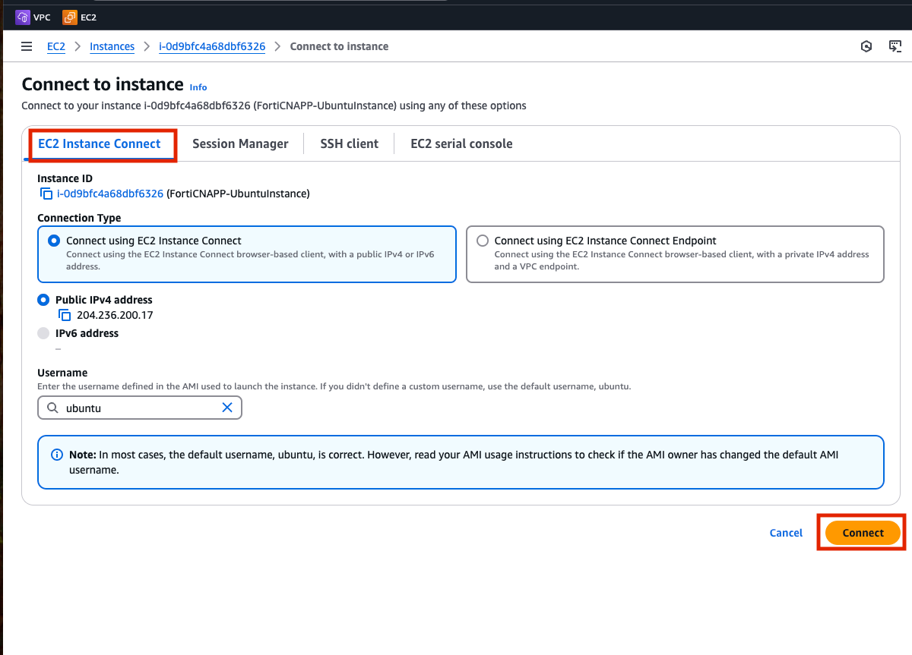

## Lab Overview

Probably one of the biggest questions you will get talking to a new customer is: `So, what will it cost?`.  FortiCNAPP uses consumption based pricing (for most of the product).  The inventory script is here to help understand how many cVPU are currently being used in a cloud account.

Note that you will be running this script on a virtual server that has the correct permission and tooling already setup.  In order to run this script with a customer they will need the AWS cli and credentials with permission to investigate EC2 vm.


## Log into AWS Console

The log in details for your lab provided AWS account are on the left hand of the lab.  Each field has a copy link you can use.

Click on the `Open Console` link.


Copy/paste the `Username`, `Password` and click `Sign In`.


## Access a Virtual Server running in EC2

EC2 is a AWS service that allows for easily creating virtual servers in the cloud.  When moving from an on prem data center to the cloud, EC2 is often part of a 'lift and shift' project.  Each virtual server in EC2 is analogous to a physical server running in your own data center.

Click on (or search for) `EC2`.


Click on `Instance (running)` to see a list of the current virtual machine running.


Select the checkbox next to `FortiCNAPP-UbuntuInstance` and then click on `Connect`.


Use the `EC2 Instance Connect` connection type and click `Connect`.



Instance connect will launch and you will be logged into your own virtual server running in AWS.  From here you will be able to run commands on the virtual server.


## RTFM (or the README in this case)

Let's start by visiting the Github README for the sizing scripts.

https://github.com/lacework-dev/scripts/tree/main/bash

## Run the script already

All we need for this lab is to the aws inventory script.  Below are the commands to download the script and make it executable.

```bash
curl -o lw_aws_inventory.sh https://raw.githubusercontent.com/lacework-dev/scripts/refs/heads/main/bash/lw_aws_inventory.sh
chmod +x lw_aws_inventory.sh
```

You can run this script without any commands and it will search over all the regions in AWS.  To make the script run quicker you will limit the script to only searching the 'us-east-1' region.  This is the only region where virtual server are running for this lab.

```bash
./lw_aws_inventory.sh -r us-east-1
```


As you can see the script only found a single vCPU, the one you using to run the script itself!

## Want to get advanced?

Let's deploy a few more virtual servers and re-run the script to ensure to it can count past one!  You will speed run over the terraform portion of the lab from the first day.  All the tooling and permission should be setup already.

```bash
cd ~
curl https://raw.githubusercontent.com/Ahmed-AG/basic-page/refs/heads/main/ec2.tf > ~/ec2.tf
terraform init
terraform apply -auto-approve 
```

## Run run the scrips to see the new vCPVs

Super, now you have two more VMs up and running in your region. Re-run the inventory script and hopefully it notices them.

```bash
./lw_aws_inventory.sh -r us-east-1
```


## Wrap up

Next steps would be to try running the script when everything is not already setup.  Start with getting the AWS cli setup locally, configuring it with credentials and run the sizing script.

Hopefully this will help when the deal starts go come down to how much it will cost.
