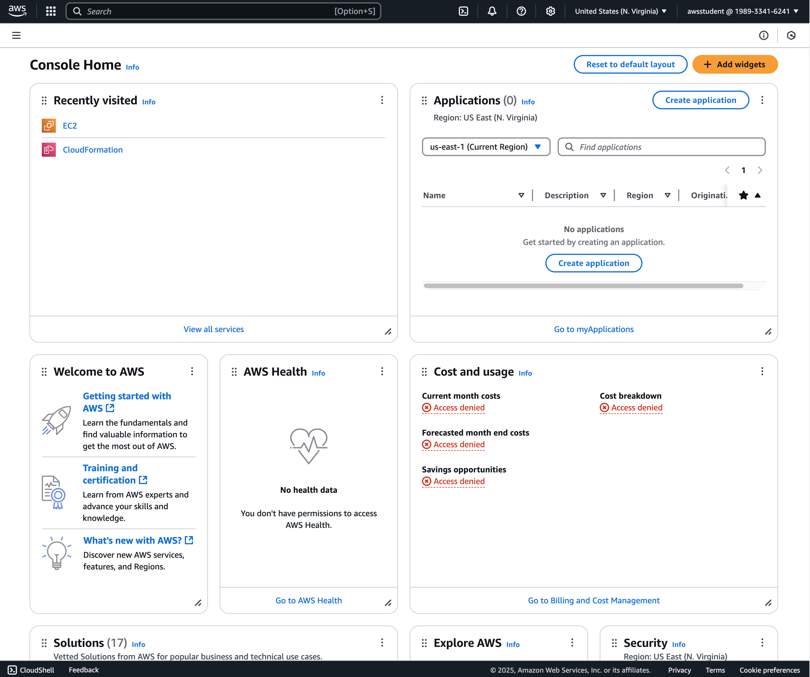

<!---->

### Welcome!

The aim of this workshop is to introduce some fundamental DevOps principles and concepts and some of the more common tools used to implement them. We'll start with an overview of a few workflows currently implemented on the FortinetCloudCSE team and then afterwards dive deeper on tooling.

### Your lab Environment:

During this class, you will need access to the following tools:

    - AWS
    - Git
    - Terraform
    - Docker
    - Kubernetes

As part of this class, you can provision a lab envirnoment that consists of and AWS Account as well as an EC2 Instance where you can run all of the above tools from.

#### Start your Lab

Start by Clicking on `Start Lab`: 

This will trigger the provisioning process for your labs, which should take about two minutes. Once the lab environment is provisioned, you should have access.
    - An AWS Account
    - An EC2 Instance that you can use to run all the labs

#### AWS Access 

There are two ways to access your AWS account:
    
    - Console access
    - CLI Access

##### Console Access:

To access the console, simply click on `Open Console` and use the `Username` and `Password` to access that `AWS Account`.

You will be greeted witht he Console Home page

Navigate to the `EC2 Service` and examine the running instances

#### EC2 Instance Access
